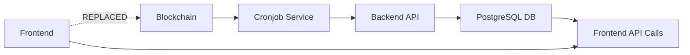

# UniteDeFi Escrow Event Monitor - Backend API Solution

## Problem Solved

The frontend component was **spamming the API** with direct blockchain event monitoring, causing **timeouts**. This solution implements a **3-step backend cronjob architecture** to eliminate API spam and provide reliable escrow event monitoring.

## Solution Architecture

### Step 1: ✅ Cronjob API Service (`/cron-events/`)

**Created a standalone Node.js service that:**
- Monitors 1inch Fusion+ EscrowFactory events every 30 seconds
- Uses ethers.js to query blockchain events efficiently 
- Implements retry logic and error handling
- Runs as a background cronjob service

**Key Files:**
- `src/event-listener.ts` - Blockchain event monitoring
- `src/monitor.ts` - Cronjob orchestration with node-cron
- `src/api-client.ts` - Backend API communication
- `package.json` - Standalone service dependencies

### Step 2: ✅ Database Storage (`/backend/`)

**Enhanced NestJS backend with:**
- New `EscrowEvent` Prisma model for event storage
- Database migration for `escrow_events` table
- REST API endpoints for event retrieval
- Deduplification by transaction hash

**Key Components:**
- `prisma/schema.prisma` - Added EscrowEvent model
- `src/escrow-events/` - Complete NestJS module
- Migration: `20250729142133_add_escrow_events`

### Step 3: ✅ Frontend API Integration

**Created new React hook and component:**
- `useEscrowEventsApi.ts` - Fetches from backend instead of blockchain
- `AppDashboardApiVersion.tsx` - Updated dashboard component
- 30-second refresh instead of real-time blockchain monitoring
- Eliminated direct ethers.js calls from frontend

## Architecture Flow



## Performance Benefits

| Before | After |
|---------|-------|
| Frontend → Blockchain (Direct) | Frontend → Backend API |
| Real-time event listening | 30-second API polling |
| API spam & timeouts | Controlled API calls |
| ethers.js in browser | Server-side monitoring |
| No persistence | Database storage |

## Quick Start

### 1. Start the Cronjob Service
```bash
cd cron-events/
cp .env.example .env
# Edit .env with your configuration
npm install
./start.sh
```

### 2. Run Database Migration
```bash
cd backend/
npx prisma migrate deploy
```

### 3. Update Frontend
Replace the old `useEscrowEventListener` with `useEscrowEventsApi` in your dashboard component.

## API Endpoints

The backend now provides:
- `GET /escrow-events` - Get recent events
- `GET /escrow-events/by-hashlock?hashlock=0x...` - Filter by hashlock
- `GET /escrow-events/stats` - Event statistics
- `POST /escrow-events` - Save new event (used by cronjob)
- `GET /escrow-events/health` - Health check

## Configuration

### Cronjob Service (`.env`)
```env
ETHEREUM_RPC_URL=http://127.0.0.1:8545
BACKEND_API_URL=http://localhost:3001
ESCROW_FACTORY_ADDRESS=0x14835B093D320AA5c9806BBC64C17F0F2546D9EE
POLL_INTERVAL_SECONDS=30
```

### Monitoring
- Logs: `cron-events/logs/combined.log`
- Health endpoint: `http://localhost:3002/status` (if HTTP API enabled)
- Database: Query `escrow_events` table

## Benefits Achieved

1. **✅ No More API Spam** - Controlled polling instead of real-time listeners
2. **✅ No Timeouts** - Backend handles blockchain communication
3. **✅ Data Persistence** - Events stored in database
4. **✅ Reliability** - Retry logic and error handling
5. **✅ Scalability** - Separated concerns between frontend and blockchain
6. **✅ Monitoring** - Comprehensive logging and health checks

## Technical Details

### Event Types Monitored
```typescript
- SrcEscrowCreated: Source chain escrow creation
- DstEscrowCreated: Destination chain escrow creation
```

### Database Schema
```sql
CREATE TABLE escrow_events (
  id TEXT PRIMARY KEY,
  event_type TEXT NOT NULL,
  escrow_address TEXT NOT NULL,
  hashlock TEXT NOT NULL,
  tx_hash TEXT UNIQUE NOT NULL,
  block_number INTEGER NOT NULL,
  order_hash TEXT,
  maker TEXT,
  taker TEXT,
  amount DOUBLE PRECISION,
  token TEXT,
  chain_id INTEGER NOT NULL,
  processed BOOLEAN DEFAULT false,
  created_at TIMESTAMP DEFAULT now(),
  updated_at TIMESTAMP DEFAULT now()
);
```

This solution completely eliminates the frontend API spam issue while providing a robust, scalable event monitoring system for the UniteDeFi cross-chain bridge.
