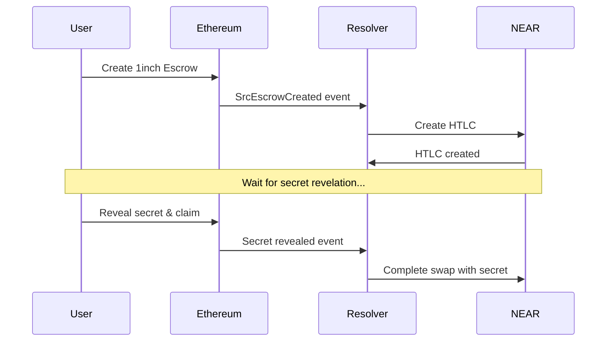

# UniteDeFi Cross-Chain Bridge - Developer Guide

## 🎯 For the Development Team

This guide is specifically designed for UniteDeFi developers to understand, modify, and extend the cross-chain bridge system.

---

## 🧠 Core Concepts

### What is an Atomic Swap?

An atomic swap ensures that either:
- ✅ **Both sides complete successfully**, OR
- ❌ **Both sides fail and funds are returned**

There's **never** a scenario where one side succeeds and the other fails.

### How Hash Time-Locked Contracts (HTLCs) Work

```
1. Alice generates a SECRET and its SHA256 HASH
2. Alice creates HTLC on Chain A with the HASH (locks her tokens)
3. Bob creates HTLC on Chain B with the same HASH (locks his tokens)
4. Alice reveals the SECRET to claim Bob's tokens on Chain B
5. Bob uses the revealed SECRET to claim Alice's tokens on Chain A
6. If no one reveals the SECRET before timeout → both refund automatically
```

### Why 1inch Fusion+ Integration?

1. **Battle-tested**: 1inch contracts handle billions in volume
2. **Gas optimization**: Efficient escrow mechanisms
3. **Deterministic addresses**: CREATE2 for predictable contract addresses
4. **Event infrastructure**: Reliable event emission for monitoring

---

## 🔧 Architecture Deep Dive

### Component Responsibilities

```typescript
// InchFusionResolver: The orchestrator
class InchFusionResolver {
  // Monitors 1inch events
  async waitForEscrowCreation() { /* ... */ }
  
  // Coordinates both chains
  async processEthToNearSwap() { /* ... */ }
  async processNearToEthSwap() { /* ... */ }
}

// NearClient: NEAR blockchain operations
class NearClient {
  // Creates HTLCs on NEAR
  async createCrossChainHTLC() { /* ... */ }
  
  // Completes swaps using revealed secrets
  async completeSwap() { /* ... */ }
}

// EthereumClient: Ethereum blockchain operations  
class EthereumClient {
  // Creates ETH HTLCs
  async createHTLCEth() { /* ... */ }
  
  // Withdraws using secrets
  async withdraw() { /* ... */ }
}
```

### Event-Driven Architecture



---

## 🛠️ Development Workflow

### 1. Setting Up Development Environment

```bash
# Clone repository
git clone https://github.com/Nairod36/UniteDeFi-Mokuen.git
cd UniteDeFi-Mokuen

# Install all dependencies
cd cross-chain && npm install
cd ../eth-contracts && forge install
cd ../near-contracts/htlc-near && cargo build --target wasm32-unknown-unknown --release

# Set up environment variables
cp .env.example .env
# Edit .env with your configuration
```

### 2. Local Development Setup

```bash
# Terminal 1: Start local Ethereum node
cd eth-contracts
anvil --accounts 10 --balance 1000

# Terminal 2: Deploy contracts locally
forge script script/DeployCrossChainBridge.s.sol --rpc-url http://localhost:8545 --broadcast

# Terminal 3: Start NEAR sandbox (if testing NEAR)
near-sandbox

# Terminal 4: Start the resolver
cd cross-chain
npm run dev
```

### 3. Testing Strategy

#### Unit Tests
```bash
# Test individual components
cd cross-chain
npm run test:unit

# Test specific files
npm run test -- --grep "InchFusionResolver"
```

#### Integration Tests
```bash
# Test full swap flows
npm run test:integration

# Test with local chains
npm run test:local
```

#### Manual Testing
```bash
# Create a test swap
curl -X POST localhost:3000/api/test-swap \
  -H "Content-Type: application/json" \
  -d '{
    "direction": "eth-to-near",
    "amount": "0.01",
    "testnet": true
  }'
```

---

## 📝 Code Organization & Patterns

### File Structure Logic

```
cross-chain/src/
├── inch-fusion-resolver.ts    # 🎯 Main orchestrator
├── near-client.ts             # 🔵 NEAR operations
├── ethereum-client.ts         # 🟠 Ethereum operations
├── types.ts                   # 📋 TypeScript interfaces
├── utils.ts                   # 🧰 Helper functions
└── escrow-event-listener.ts   # 👂 Event monitoring
```

### Coding Patterns Used

#### 1. Event-Driven Pattern
```typescript
// Listen for blockchain events
escrowFactory.on('SrcEscrowCreated', async (event) => {
  if (event.hashlock === ourHashlock) {
    // Coordinate cross-chain action
    await this.createNearHTLC(event.data);
  }
});
```

#### 2. Promise-Based Coordination
```typescript
// Wait for conditions with timeout
return new Promise((resolve, reject) => {
  const timeout = setTimeout(() => {
    cleanup();
    reject(new Error('Timeout'));
  }, timeoutMs);
  
  // Set up event listeners
  contract.on('event', (data) => {
    cleanup();
    resolve(data);
  });
});
```

#### 3. Error Handling Pattern
```typescript
async processSwap(params: SwapParams): Promise<SwapResult> {
  try {
    // Main logic
    const result = await doSwap(params);
    return { success: true, ...result };
  } catch (error) {
    console.error('Swap failed:', error);
    return { 
      success: false, 
      error: error instanceof Error ? error.message : String(error) 
    };
  }
}
```

---

## 🔍 Debugging Guide

### Common Issues & Solutions

#### 1. "EscrowFactory not found"
```typescript
// Check network configuration
const network = await provider.getNetwork();
console.log('Current network:', network.chainId);

// Verify 1inch address for your network
const ESCROW_FACTORIES = {
  1: '0xa7bcb4eac8964306f9e3764f67db6a7af6ddf99a',      // Mainnet
  11155111: '0x...', // Sepolia (update with correct address)
};
```

#### 2. Event Listener Timeouts
```typescript
// Increase timeout for slow networks
const NETWORK_TIMEOUTS = {
  mainnet: 60000,    // 60 seconds
  testnet: 120000,   // 2 minutes
  local: 10000       // 10 seconds
};

await this.waitForEscrowCreation(hash, 'src', NETWORK_TIMEOUTS[network]);
```

#### 3. Gas Issues
```typescript
// Dynamic gas price calculation
const feeData = await provider.getFeeData();
const gasPrice = feeData.gasPrice?.mul(110).div(100); // 10% buffer

// Gas estimation
const gasLimit = await contract.estimateGas.createHTLC(...args);
const bufferedGas = gasLimit.mul(120).div(100); // 20% buffer
```

#### 4. NEAR Account Issues
```typescript
// Check account exists and has funds
const account = await near.account(accountId);
const balance = await account.getAccountBalance();
console.log('NEAR balance:', balance);

// Check contract is deployed
const contractCode = await account.viewFunction(contractId, 'get_version', {});
```

### Debugging Tools

#### 1. Enhanced Logging
```typescript
// Add to resolver constructor
if (process.env.DEBUG) {
  this.enableDebugLogging();
}

private enableDebugLogging() {
  // Log all contract calls
  this.ethProvider.on('debug', (info) => {
    console.log('ETH Debug:', info);
  });
  
  // Log NEAR calls
  this.nearClient.on('call', (method, args) => {
    console.log('NEAR Call:', method, args);
  });
}
```

#### 2. Transaction Tracing
```typescript
// Trace Ethereum transactions
async traceTransaction(txHash: string) {
  const receipt = await this.ethProvider.getTransactionReceipt(txHash);
  const logs = receipt.logs.map(log => {
    try {
      return this.contract.interface.parseLog(log);
    } catch {
      return { raw: log };
    }
  });
  
  console.log('Transaction logs:', logs);
  return logs;
}
```

#### 3. State Inspection
```typescript
// Check current state of swaps
async getSwapState(swapId: string) {
  const ethState = await this.ethContract.getSwap(swapId);
  const nearState = await this.nearClient.getContract(swapId);
  
  return {
    ethereum: ethState,
    near: nearState,
    synchronized: this.compareStates(ethState, nearState)
  };
}
```

---

## 🚀 Extending the System

### Adding New Token Support

#### 1. ERC20 Token Support
```typescript
// Add to EthereumClient
async createHTLCERC20(
  tokenAddress: string,
  amount: string,
  receiver: string,
  hashlock: string,
  timelock: number,
  nearAccount: string
): Promise<{ contractId: string; txHash: string }> {
  // Approve token transfer first
  const token = new ethers.Contract(tokenAddress, ERC20_ABI, this.wallet);
  const approveTx = await token.approve(this.htlcContract.address, amount);
  await approveTx.wait();
  
  // Create HTLC
  const tx = await this.htlcContract.createHTLC(
    receiver,
    tokenAddress,
    amount,
    hashlock,
    timelock,
    nearAccount
  );
  
  return { contractId: tx.hash, txHash: tx.hash };
}
```

#### 2. NEAR NEP-141 Token Support
```rust
// Add to NEAR contract (lib.rs)
#[payable]
pub fn create_htlc_nep141(
    &mut self,
    token_contract: AccountId,
    receiver: AccountId,
    amount: U128,
    hashlock: String,
    timelock: u64,
    eth_address: String,
) -> String {
    // Transfer tokens to contract
    ext_nep141::ft_transfer_call(
        env::current_account_id(),
        amount,
        None,
        "htlc_deposit".to_string(),
        token_contract,
        1,
        Gas(5_000_000_000_000),
    );
    
    // Create HTLC entry
    self.create_htlc_internal(receiver, amount, hashlock, timelock, eth_address)
}
```

### Adding New Chain Support

#### 1. Create New Client
```typescript
// Example: PolygonClient
export class PolygonClient extends EthereumClient {
  constructor(config: PolygonConfig) {
    super({
      ...config,
      chainId: 137, // Polygon mainnet
      htlcContract: POLYGON_HTLC_ADDRESS
    });
  }
  
  // Override for Polygon-specific optimizations
  async estimateGas(method: string, args: any[]): Promise<string> {
    const estimate = await super.estimateGas(method, args);
    // Polygon has cheaper gas
    return estimate.mul(80).div(100).toString();
  }
}
```

#### 2. Update Resolver
```typescript
// Add to InchFusionResolver
private polygonClient: PolygonClient;

async processEthToPolygonSwap(params: EthToPolygonSwap): Promise<SwapResult> {
  // Similar to processEthToNearSwap but with Polygon
  try {
    const escrowAddress = await this.waitForEscrowCreation(params.secretHash);
    const polygonTxHash = await this.polygonClient.createHTLC(params);
    // ... rest of logic
  } catch (error) {
    return { success: false, error: error.message };
  }
}
```

---

## 🔐 Security Best Practices

### 1. Private Key Management

```typescript
// ❌ Bad: Hardcoded keys
const privateKey = '0x1234567890abcdef...';

// ✅ Good: Environment variables
const privateKey = process.env.RESOLVER_PRIVATE_KEY;
if (!privateKey) {
  throw new Error('RESOLVER_PRIVATE_KEY not set');
}

// ✅ Better: Encrypted key store
import { Wallet } from '@ethersproject/wallet';
const wallet = await Wallet.fromEncryptedJson(keystore, password);
```

### 2. Input Validation

```typescript
// Validate all inputs
function validateSwapParams(params: SwapParams): void {
  if (!ethers.utils.isAddress(params.ethRecipient)) {
    throw new Error('Invalid Ethereum address');
  }
  
  if (!params.nearAccount.endsWith('.near')) {
    throw new Error('Invalid NEAR account');
  }
  
  if (params.amount <= 0) {
    throw new Error('Amount must be positive');
  }
  
  if (params.timelock <= Date.now() / 1000) {
    throw new Error('Timelock must be in the future');
  }
}
```

### 3. Rate Limiting

```typescript
// Implement rate limiting for API endpoints
import rateLimit from 'express-rate-limit';

const swapLimiter = rateLimit({
  windowMs: 15 * 60 * 1000, // 15 minutes
  max: 10, // limit each IP to 10 swaps per windowMs
  message: 'Too many swap requests, please try again later.'
});

app.post('/api/swap', swapLimiter, async (req, res) => {
  // Handle swap request
});
```

### 4. Amount Limits

```typescript
// Set reasonable limits
const LIMITS = {
  MIN_ETH_AMOUNT: ethers.utils.parseEther('0.001'),  // 0.001 ETH
  MAX_ETH_AMOUNT: ethers.utils.parseEther('10'),     // 10 ETH
  MIN_NEAR_AMOUNT: ethers.utils.parseUnits('1', 24), // 1 NEAR
  MAX_NEAR_AMOUNT: ethers.utils.parseUnits('1000', 24), // 1000 NEAR
};

function validateAmount(amount: string, currency: 'ETH' | 'NEAR'): void {
  const parsedAmount = currency === 'ETH' 
    ? ethers.utils.parseEther(amount)
    : ethers.utils.parseUnits(amount, 24);
    
  const limits = currency === 'ETH' 
    ? { min: LIMITS.MIN_ETH_AMOUNT, max: LIMITS.MAX_ETH_AMOUNT }
    : { min: LIMITS.MIN_NEAR_AMOUNT, max: LIMITS.MAX_NEAR_AMOUNT };
    
  if (parsedAmount.lt(limits.min) || parsedAmount.gt(limits.max)) {
    throw new Error(`Amount must be between ${limits.min} and ${limits.max}`);
  }
}
```

---

## 📊 Monitoring & Analytics

### 1. Health Checks

```typescript
// Health check endpoint
app.get('/health', async (req, res) => {
  try {
    const health = {
      ethereum: {
        connected: await this.checkEthConnection(),
        balance: await this.resolver.getEthBalance(),
        gasPrice: await this.ethProvider.getGasPrice()
      },
      near: {
        connected: await this.checkNearConnection(),
        balance: await this.nearClient.getBalance(),
        blockHeight: await this.nearClient.getBlockHeight()
      },
      resolver: {
        status: this.resolver.getStatus(),
        uptime: process.uptime(),
        version: process.env.npm_package_version
      }
    };
    
    res.json(health);
  } catch (error) {
    res.status(500).json({ error: error.message });
  }
});
```

### 2. Metrics Collection

```typescript
// Track swap metrics
class SwapMetrics {
  private swapCounts = new Map<string, number>();
  private swapVolumes = new Map<string, string>();
  
  recordSwap(direction: string, amount: string, success: boolean) {
    const key = `${direction}_${success ? 'success' : 'failed'}`;
    this.swapCounts.set(key, (this.swapCounts.get(key) || 0) + 1);
    
    if (success) {
      const currentVolume = this.swapVolumes.get(direction) || '0';
      const newVolume = ethers.BigNumber.from(currentVolume).add(amount);
      this.swapVolumes.set(direction, newVolume.toString());
    }
  }
  
  getMetrics() {
    return {
      counts: Object.fromEntries(this.swapCounts),
      volumes: Object.fromEntries(this.swapVolumes)
    };
  }
}
```

### 3. Alerting

```typescript
// Set up alerts for critical issues
class AlertManager {
  async checkCriticalConditions() {
    const ethBalance = await this.resolver.getEthBalance();
    if (ethBalance.lt(ethers.utils.parseEther('0.1'))) {
      await this.sendAlert('LOW_ETH_BALANCE', {
        balance: ethers.utils.formatEther(ethBalance)
      });
    }
    
    const failedSwaps = await this.getFailedSwapsCount(24); // last 24 hours
    if (failedSwaps > 10) {
      await this.sendAlert('HIGH_FAILURE_RATE', {
        failures: failedSwaps
      });
    }
  }
  
  async sendAlert(type: string, data: any) {
    // Send to Discord webhook
    await fetch(process.env.DISCORD_WEBHOOK_URL, {
      method: 'POST',
      headers: { 'Content-Type': 'application/json' },
      body: JSON.stringify({
        content: `🚨 Alert: ${type}`,
        embeds: [{
          title: type,
          description: JSON.stringify(data, null, 2),
          color: 0xff0000
        }]
      })
    });
  }
}
```

---

## 🚢 Deployment Guide

### 1. Production Deployment

```bash
# Build for production
npm run build

# Set production environment
export NODE_ENV=production
export RESOLVER_PRIVATE_KEY="..."
export ETH_RPC_URL="..."
export NEAR_PRIVATE_KEY="..."

# Run with PM2 for process management
npm install -g pm2
pm2 start ecosystem.config.js

# Set up reverse proxy (nginx)
sudo nginx -t && sudo systemctl reload nginx
```

### 2. Docker Deployment

```dockerfile
# Dockerfile
FROM node:18-alpine

WORKDIR /app
COPY package*.json ./
RUN npm ci --only=production

COPY dist/ ./dist/
COPY config/ ./config/

EXPOSE 3000
CMD ["node", "dist/index.js"]
```

```yaml
# docker-compose.yml
version: '3.8'
services:
  bridge-resolver:
    build: .
    ports:
      - "3000:3000"
    environment:
      - NODE_ENV=production
      - RESOLVER_PRIVATE_KEY=${RESOLVER_PRIVATE_KEY}
    volumes:
      - ./logs:/app/logs
    restart: unless-stopped
```

### 3. Monitoring Setup

```yaml
# monitoring/prometheus.yml
global:
  scrape_interval: 15s

scrape_configs:
  - job_name: 'bridge-resolver'
    static_configs:
      - targets: ['localhost:3000']
    metrics_path: '/metrics'
```

---

## 📚 Additional Resources

### Learning Materials

1. **1inch Fusion+ Documentation**: https://docs.1inch.io/docs/fusion-plus/
2. **NEAR Smart Contracts**: https://docs.near.org/sdk/rust/introduction
3. **Ethereum Development**: https://ethereum.org/developers/
4. **ethers.js Documentation**: https://docs.ethers.io/v5/

### Tools & Libraries

1. **Testing**: Jest, Hardhat, near-workspaces
2. **Monitoring**: Prometheus, Grafana, Winston
3. **Security**: Slither, MythX, Securify
4. **Development**: Hardhat, Foundry, near-cli

### Team Communication

- **Daily Standups**: 9:00 AM UTC
- **Code Reviews**: Required for all PRs
- **Architecture Decisions**: Document in `/docs/adr/`
- **Security Reviews**: Weekly security calls

---

*Happy coding! 🚀*

*If you have questions, ping the team on Discord or create an issue on GitHub.*
