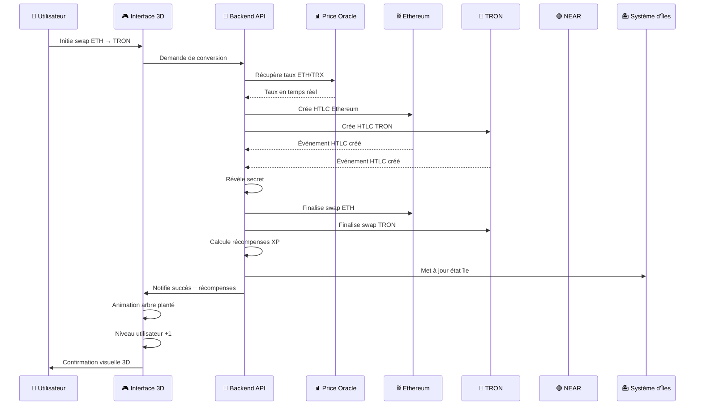
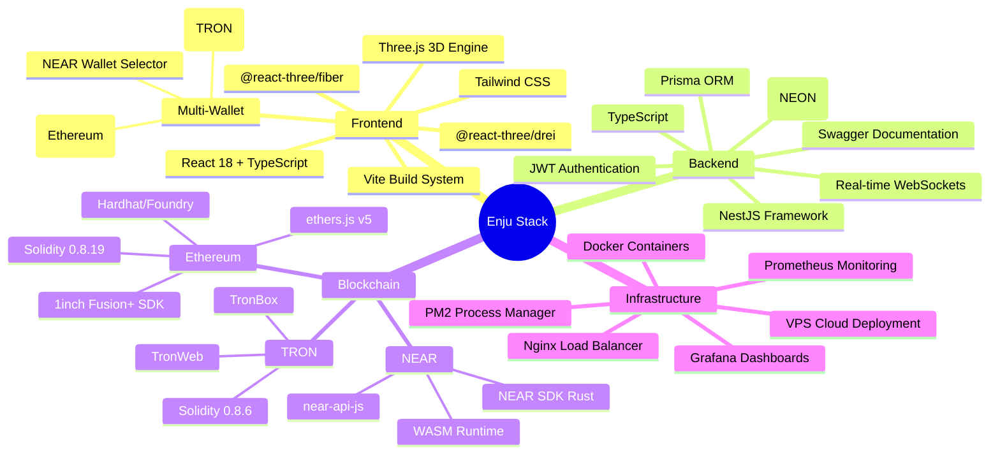

# Enju - Architecture Complète et Analyse du Projet

## 🎯 Vue d'ensemble du projet

**Enju** est une plateforme DeFi gamifiée révolutionnaire qui transforme les bridges cross-chain traditionnels en une expérience immersive 3D. Construit comme une extension du protocole 1inch Fusion+, il permet des swaps atomiques seamless **ETH ↔ NEAR ↔ TRON** tout en récompensant les utilisateurs avec un écosystème 3D unique qui évolue avec leur activité DeFi.

## 🏗️ Architecture Complète - Schéma Mermaid

```mermaid
graph TB
    subgraph "🎮 Frontend Layer - Enju 3D World"
        UI[React + Vite Frontend]
        THREE[Three.js 3D Engine]
        ISLANDS[Dynamic Islands System]
        ANIMALS[Chain Animals<br/>🐘 ETH, 🐅 TRON, 🦊 NEAR]
        WALLET[Multi-Wallet Integration<br/>MetaMask, TronLink, NEAR]
        GAMIFICATION[Gamification System<br/>Levels, XP, Rewards]
    end

    subgraph "🔗 Multi-Chain Integration"
        ETH_CHAIN[Ethereum Network]
        TRON_CHAIN[TRON Network]
        NEAR_CHAIN[NEAR Network]
        INCH_API[1inch Swap API]
    end

    subgraph "🏢 Backend Services - NestJS"
        API_SERVER[NestJS API Server]
        AUTH_SERVICE[Authentication Service]
        BRIDGE_SERVICE[Bridge Service]
        ISLANDS_SERVICE[Islands Service]
        REWARDS_SERVICE[Rewards Service]
        ONEINCH_SERVICE[1inch Integration Service]
        TRANSACTIONS_SERVICE[Transactions Service]
        USERS_SERVICE[Users Service]
        RPC_SERVICE[RPC Management Service]
    end

    subgraph "🌉 Cross-Chain Bridge System"
        BRIDGE_LISTENER[Bridge Event Listener]
        PRICE_ORACLE[Real-Time Price Oracle<br/>CoinGecko + Binance APIs]
        BRIDGE_RESOLVER[Cross-Chain Resolver]
        ETH_LISTENER[Ethereum Event Listener]
        TRON_LISTENER[TRON Event Listener]
        NEAR_LISTENER[NEAR Event Listener]
    end

    subgraph "📊 Smart Contracts"
        ETH_ESCROW[1inch EscrowFactory<br/>Battle-tested Security]
        ETH_BRIDGE[CrossChainCore.sol]
        ETH_INCH_BRIDGE[InchDirectBridge.sol]
        TRON_BRIDGE[TronFusionBridge.sol<br/>HTLC + Fund Transfers]
        NEAR_HTLC[HTLC Contract<br/>htlc-near.rs]
        REWARD_TOKEN[RewardToken.sol]
        ANIMAL_NFT[AnimalNFT.sol]
        MARKETPLACE[AnimalMarketplace.sol]
    end

    subgraph "💾 Database & Storage"
        POSTGRES[(PostgreSQL Database<br/>NEON Cloud)]
        PRISMA[Prisma ORM]
        USER_DATA[(User Profiles & Progress)]
        ISLAND_DATA[(Island States & Assets)]
        TRANSACTION_DATA[(Transaction History)]
        REWARD_DATA[(Rewards & Achievements)]
    end

    subgraph "🔐 Security & Infrastructure"
        JWT_AUTH[JWT Authentication]
        RATE_LIMIT[Rate Limiting]
        INPUT_VALIDATION[Input Validation]
        EMERGENCY_STOP[Emergency Stop Mechanisms]
        AUDIT_LOGS[Audit Trail System]
    end

    subgraph "☁️ Cloud Infrastructure"
        VPS[VPS Server Deployment]
        NGINX[Nginx Load Balancer]
        PM2[PM2 Process Manager]
        DOCKER[Docker Containers]
        MONITORING[Prometheus + Grafana]
    end

    %% Frontend Connections
    UI --> THREE
    UI --> ISLANDS
    UI --> ANIMALS
    UI --> WALLET
    UI --> GAMIFICATION
    UI --> API_SERVER

    %% Backend Service Connections
    API_SERVER --> AUTH_SERVICE
    API_SERVER --> BRIDGE_SERVICE
    API_SERVER --> ISLANDS_SERVICE
    API_SERVER --> REWARDS_SERVICE
    API_SERVER --> ONEINCH_SERVICE
    API_SERVER --> TRANSACTIONS_SERVICE
    API_SERVER --> USERS_SERVICE
    API_SERVER --> RPC_SERVICE

    %% Bridge System Connections
    BRIDGE_SERVICE --> BRIDGE_LISTENER
    BRIDGE_SERVICE --> PRICE_ORACLE
    BRIDGE_SERVICE --> BRIDGE_RESOLVER
    BRIDGE_LISTENER --> ETH_LISTENER
    BRIDGE_LISTENER --> TRON_LISTENER
    BRIDGE_LISTENER --> NEAR_LISTENER

    %% Blockchain Connections
    ETH_LISTENER --> ETH_CHAIN
    TRON_LISTENER --> TRON_CHAIN
    NEAR_LISTENER --> NEAR_CHAIN
    ONEINCH_SERVICE --> INCH_API

    %% Smart Contract Connections
    ETH_CHAIN --> ETH_ESCROW
    ETH_CHAIN --> ETH_BRIDGE
    ETH_CHAIN --> ETH_INCH_BRIDGE
    ETH_CHAIN --> REWARD_TOKEN
    ETH_CHAIN --> ANIMAL_NFT
    ETH_CHAIN --> MARKETPLACE
    TRON_CHAIN --> TRON_BRIDGE
    NEAR_CHAIN --> NEAR_HTLC

    %% Database Connections
    API_SERVER --> PRISMA
    PRISMA --> POSTGRES
    POSTGRES --> USER_DATA
    POSTGRES --> ISLAND_DATA
    POSTGRES --> TRANSACTION_DATA
    POSTGRES --> REWARD_DATA

    %% Security Layer
    API_SERVER --> JWT_AUTH
    API_SERVER --> RATE_LIMIT
    API_SERVER --> INPUT_VALIDATION
    BRIDGE_SERVICE --> EMERGENCY_STOP
    API_SERVER --> AUDIT_LOGS

    %% Infrastructure
    VPS --> NGINX
    VPS --> PM2
    VPS --> DOCKER
    VPS --> MONITORING

    %% Styling
    classDef frontend fill:#61DAFB,stroke:#000,color:#000
    classDef backend fill:#E0234E,stroke:#fff,color:#fff
    classDef blockchain fill:#627EEA,stroke:#fff,color:#fff
    classDef bridge fill:#FF6B6B,stroke:#fff,color:#fff
    classDef contracts fill:#9B59B6,stroke:#fff,color:#fff
    classDef database fill:#336791,stroke:#fff,color:#fff
    classDef security fill:#E74C3C,stroke:#fff,color:#fff
    classDef infrastructure fill:#2ECC71,stroke:#fff,color:#fff

    class UI,THREE,ISLANDS,ANIMALS,WALLET,GAMIFICATION frontend
    class API_SERVER,AUTH_SERVICE,BRIDGE_SERVICE,ISLANDS_SERVICE,REWARDS_SERVICE,ONEINCH_SERVICE,TRANSACTIONS_SERVICE,USERS_SERVICE,RPC_SERVICE backend
    class ETH_CHAIN,TRON_CHAIN,NEAR_CHAIN,INCH_API blockchain
    class BRIDGE_LISTENER,PRICE_ORACLE,BRIDGE_RESOLVER,ETH_LISTENER,TRON_LISTENER,NEAR_LISTENER bridge
    class ETH_ESCROW,ETH_BRIDGE,ETH_INCH_BRIDGE,TRON_BRIDGE,NEAR_HTLC,REWARD_TOKEN,ANIMAL_NFT,MARKETPLACE contracts
    class POSTGRES,PRISMA,USER_DATA,ISLAND_DATA,TRANSACTION_DATA,REWARD_DATA database
    class JWT_AUTH,RATE_LIMIT,INPUT_VALIDATION,EMERGENCY_STOP,AUDIT_LOGS security
    class VPS,NGINX,PM2,DOCKER,MONITORING infrastructure
```

## 🔄 Flux de Données Cross-Chain

## 🏗️ Stack Technique Détaillé

