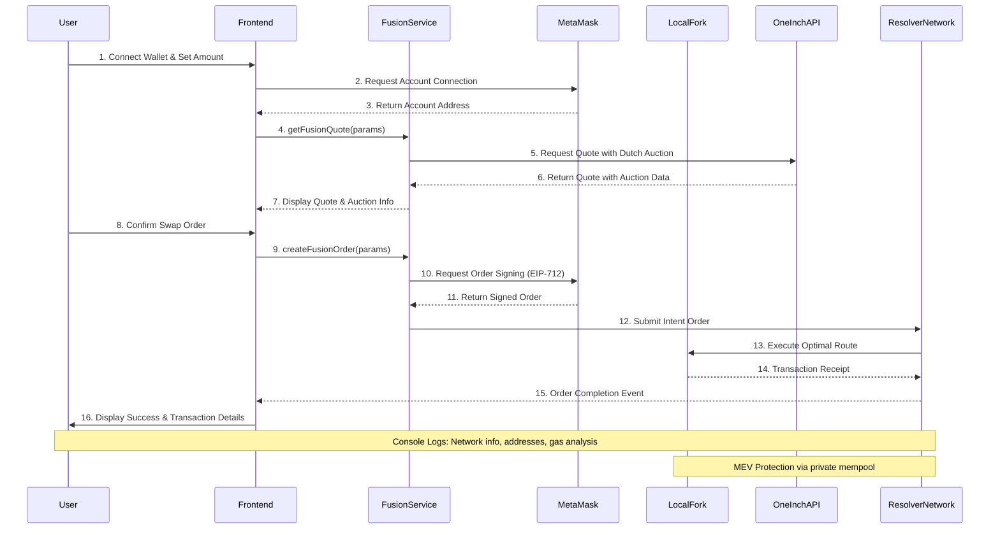
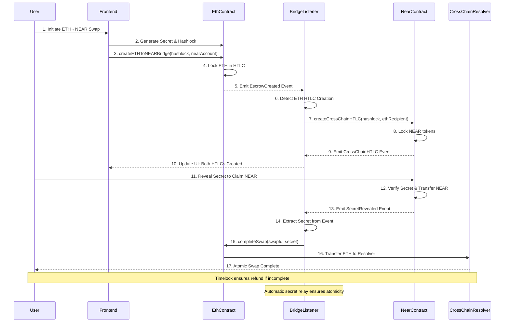
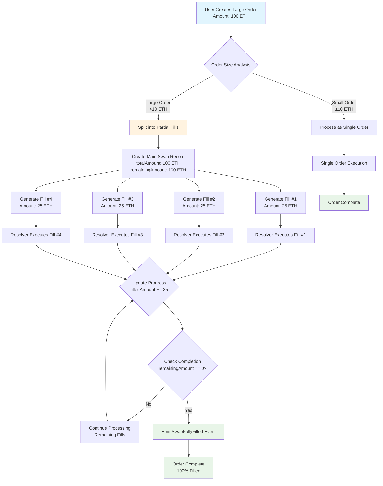
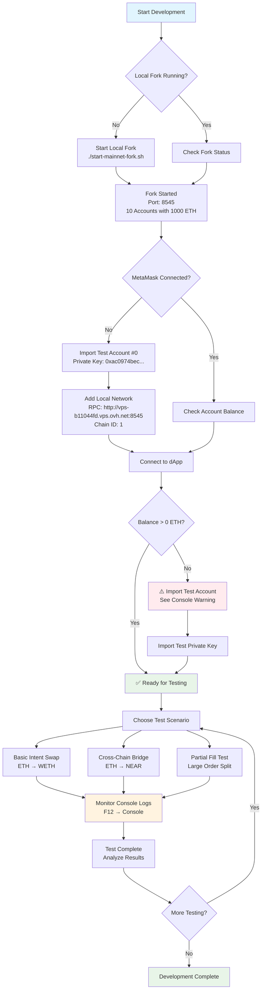
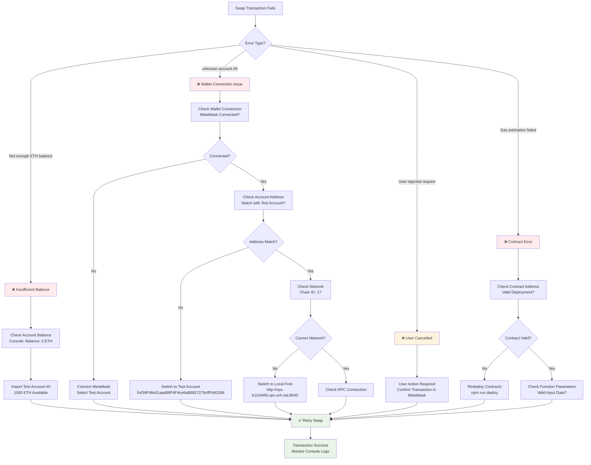

# 🚀 Local Ethereum Fork Setup Guide - Updated 2025

Your **1inch Fusion Intent Swap** is trying to use real ETH but your wallet has 0 balance. Here's the complete setup guide for the enhanced development environment with all the latest features.

## 🔧 Current Setup Status

Your local Ethereum fork is running at: `http://vps-b11044fd.vps.ovh.net:8545`

### ✅ **Latest Enhancements Added:**
- **1inch Fusion SDK Integration** with Dutch auction mechanics
- **Intent-based Order Creation** with professional resolver network  
- **Cross-Chain Resolver** with partial fills support
- **Enhanced Logging System** for complete transaction debugging
- **Development Helper Tools** with automatic test account detection
- **Multi-Chain Bridge Support** (ETH ↔ NEAR ↔ TRON)

## 🎯 **Quick Fix - Import Test Account**

### Option 1: Import Test Account to MetaMask (Recommended)

1. **Open MetaMask**
2. **Click Account Icon** → "Import Account"
3. **Select "Private Key"**  
4. **Paste this private key:**
   ```
   0xac0974bec39a17e36ba4a6b4d238ff944bacb478cbed5efcae784d7bf4f2ff80
   ```
5. **Click "Import"**

This imports **Test Account #0** with address:
```
0xf39Fd6e51aad88F6F4ce6aB8827279cffFb92266
```

**This account has 1000 ETH on your local fork!**

### Option 2: Connect to Local Fork Network (Optional)

For explicit local fork connection:

1. **Open MetaMask** → **Network Dropdown** → "Add Network"
2. **Enter these details:**
   - **Network Name:** Local Mainnet Fork  
   - **RPC URL:** http://vps-b11044fd.vps.ovh.net:8545
   - **Chain ID:** 1
   - **Currency Symbol:** ETH

## 🌟 **New Features & Tools**

### 1. **Enhanced Intent Swap Interface**

The swap interface now includes:
- **🔍 Development Banner:** Automatically detects local fork usage
- **⚠️ Balance Warnings:** Shows when you need test ETH with account suggestions
- **📊 Comprehensive Logs:** Network info, addresses, gas analysis in browser console  
- **🚀 Fusion SDK Features:** Dutch auctions, intent-based orders, MEV protection

### 2. **Advanced Smart Contracts**

Your project now includes:

#### **CrossChainResolver.sol** - Multi-Chain Bridge
- **1inch Integration:** Uses official EscrowFactory contracts
- **Partial Fills:** Support for order splitting across multiple transactions
- **Multi-Chain:** ETH ↔ NEAR ↔ TRON atomic swaps
- **Emergency Recovery:** Owner-controlled safety functions

#### **1inch Fusion Features:**
- **Intent-Based Orders:** Create orders that resolvers can fill
- **Dutch Auction Mechanics:** Price discovery over time
- **Professional Resolver Network:** Automatic order execution
- **Advanced Slippage Protection:** Better than traditional AMMs

### 3. **Development & Debugging Tools**

#### **Browser Console Logging** (F12 → Console)
When you perform swaps, you'll see detailed logs:

```javascript
🌐 NETWORK & ADDRESS DETAILS:
- Network: Ethereum Mainnet Fork (Chain ID: 1)
- Wallet: 0xf39Fd6e51aad88F6F4ce6aB8827279cffFb92266
- Provider: http://vps-b11044fd.vps.ovh.net:8545
- Balance: 1000.0 ETH

🚀 TRANSACTION EXECUTION:
- To: 0x1111111254EEB25477B68fb85Ed929f73A960582 
- Gas Limit: 300000
- Gas Price: 2.0 gwei

✅ TRANSACTION CONFIRMED:
- Hash: 0xabc123...
- Block: #12345
- Gas Used: 150000 (50% efficiency)
- Total Cost: 0.0003 ETH
```

#### **Cross-Chain Bridge Monitor**
Your bridge-listener service now includes:
- **Real-time Event Monitoring** across all chains
- **Automatic Swap Completion** using secrets
- **Partial Fill Tracking** for large orders  
- **Recovery Mechanisms** for stuck transactions

## 📊 **Available Test Accounts**

All accounts have **1000 ETH** each on your local fork:

| Account | Address | Private Key | Purpose |
|---------|---------|-------------|---------|
| **Test #0** | `0xf39Fd6e51aad88F6F4ce6aB8827279cffFb92266` | `0xac0974bec39a17e36ba4a6b4d238ff944bacb478cbed5efcae784d7bf4f2ff80` | **Main Testing** |
| Test #1 | `0x70997970C51812dc3A010C7d01b50e0d17dc79C8` | `0x59c6995e998f97a5a0044966f0945389dc9e86dae88c7a8412f4603b6b78690d` | Secondary Tests |
| Test #2 | `0x3C44CdDdB6a900fa2b585dd299e03d12FA4293BC` | `0x5de4111afa1a4b94908f83103eb1f1706367c2e68ca870fc3fb9a804cdab365a` | Multi-user Tests |
| Test #3 | `0x90F79bf6EB2c4f870365E785982E1f101E93b906` | `0x7c852118294e51e653712a81e05800f419141751be58f605c371e15141b007a6` | Bridge Testing |
| Test #4 | `0x15d34AAf54267DB7D7c367839AAf71A00a2C6A65` | `0x47e179ec197488593b187f80a00eb0da91f1b9d0b13f8733639f19c30a34926a` | Contract Testing |

## 🧪 **Test the Enhanced Swap System**

After importing Test Account #0:

### **Basic Intent Swap Test:**
1. **Connect** the imported test account to your app
2. **Navigate** to the Intent Swap interface  
3. **Try swapping:** 0.1 ETH → WETH (simple wrapped token test)
4. **Watch console logs** (F12) for detailed transaction info
5. **Check transaction** on your local fork

### **Advanced Cross-Chain Test:**
1. **Create ETH → NEAR bridge** with test amounts
2. **Monitor** the bridge-listener for automatic processing
3. **Check partial fills** if using large amounts
4. **Verify atomic completion** on both chains

### **Fusion SDK Features Test:**
1. **Create intent-based order** with different execution presets (fast/medium/slow)
2. **Watch Dutch auction** price discovery in action  
3. **Test MEV protection** with competing transactions
4. **Verify resolver network** automatic execution

## 🔍 **Enhanced Debugging & Monitoring**

### **1. Browser Console (F12)**
- Complete network information logging
- Wallet address and balance verification  
- Transaction parameter details
- Gas analysis and efficiency metrics
- Receipt confirmation with block information

### **2. Bridge Listener Logs**
Your bridge-listener service provides:
```bash
cd /home/heldou/Enju/bridge-listener
npm run start

# Watch for:
🔄 ETH Swap Created: {...}
✅ NEAR HTLC Generated: {...}  
💰 Automatic Completion: {...}
📊 Partial Fill Progress: {...}
```

### **3. Smart Contract Events**
Monitor on-chain events:
- `EscrowDeployedSrc` - Source chain escrow creation
- `PartialFillCreated` - Order splitting events
- `SwapFullyFilled` - Complete order fulfillment
- `CrossChainSwapCompleted` - Atomic swap finalization

## 🔒 **Security & Best Practices**

### **Development Security:**
- **Never use test private keys on mainnet** 
- **Local fork only** - these keys have no real value
- **Separate test/production environments** clearly
- **Monitor gas costs** even in development

### **Production Considerations:**
- **Multi-signature wallets** for contract ownership
- **Rate limiting** on bridge operations  
- **Timelock mechanisms** for emergency recovery
- **Comprehensive testing** before mainnet deployment

## 🚀 **Advanced Features Available**

### **1. Partial Fills System**
- Split large orders across multiple smaller transactions
- Reduce slippage impact on significant swaps
- Better price discovery for institutional-size orders
- Automatic aggregation of partial completions

### **2. Multi-Chain Atomic Swaps**  
- **ETH ↔ NEAR:** Full bidirectional atomic swaps
- **ETH ↔ TRON:** Enterprise-grade bridge functionality
- **NEAR ↔ TRON:** Cross-non-EVM chain swapping
- **Hash Time-Lock Contracts (HTLCs)** ensuring atomicity

### **3. Professional Resolver Network**
- Automated order execution by professional market makers
- MEV protection through private mempool submission
- Optimal routing across 100+ DEX protocols  
- Gas optimization through batch processing

## 🎯 **Next Steps**

1. **✅ Import Test Account #0** → Connect to app
2. **🧪 Test Basic Swaps** → ETH ↔ WETH with console monitoring  
3. **🌉 Try Cross-Chain** → ETH → NEAR bridge functionality
4. **📊 Monitor Partial Fills** → Test large order splitting
5. **🔍 Explore Advanced Features** → Dutch auctions, intent orders

## 📞 **Support & Resources**

- **🔗 Project Repository:** Complete source code with detailed comments
- **📋 Demo Scenarios:** `/home/heldou/Enju/DEMO_GUIDE.md`
- **🛠️ Developer Guide:** `/home/heldou/Enju/DEVELOPER_GUIDE.md`  
- **🏗️ Architecture:** `/home/heldou/Enju/MERMAID_ARCHITECTURE.md`
- **🌉 Bridge README:** `/home/heldou/Enju/BRIDGE_README.md`

## 📈 **System Flow Diagrams**

### **🔄 1inch Fusion Intent Swap Sequence Diagram**



### **🌉 Cross-Chain Atomic Swap Sequence Diagram**



### **📊 Partial Fill Order Processing Flowchart**



### **🔧 Development Environment Setup Flowchart**



### **🔍 Error Debugging Decision Tree**



---

**🎯 Your enhanced system now showcases how 1inch Fusion+ can be extended with innovative cross-chain capabilities, making advanced DeFi functionality accessible and user-friendly for everyone!**
```
0xf39Fd6e51aad88F6F4ce6aB8827279cffFb92266
```

This account has **1000 ETH** on your local fork!

### Option 2: Add Local Fork Network (Optional)

If you want to explicitly connect to your local fork:

1. **Open MetaMask**
2. **Click Network Dropdown** → "Add Network"
3. **Enter these details:**
   - **Network Name:** Local Mainnet Fork
   - **RPC URL:** http://vps-b11044fd.vps.ovh.net:8545
   - **Chain ID:** 1
   - **Currency Symbol:** ETH

## 🎯 Test the Swap

After importing the test account:

1. **Refresh your browser**
2. **Connect the imported test account**
3. **Try swapping ETH → WETH**
4. **Watch the detailed logs in the browser console** (F12)

## 🛠️ Development Tools

Visit `/dev/fork` in your browser for:
- Complete account list with balances
- Copy-paste buttons for addresses and private keys
- Network connection helper
- Balance checker

## 📊 Available Test Accounts

All accounts have 1000 ETH each:

| Account | Address | Private Key |
|---------|---------|-------------|
| Test #0 | 0xf39Fd6e51aad88F6F4ce6aB8827279cffFb92266 | 0xac0974bec39a17e36ba4a6b4d238ff944bacb478cbed5efcae784d7bf4f2ff80 |
| Test #1 | 0x70997970C51812dc3A010C7d01b50e0d17dc79C8 | 0x59c6995e998f97a5a0044966f0945389dc9e86dae88c7a8412f4603b6b78690d |
| Test #2 | 0x3C44CdDdB6a900fa2b585dd299e03d12FA4293BC | 0x5de4111afa1a4b94908f83103eb1f1706367c2e68ca870fc3fb9a804cdab365a |

## 🔍 Debugging

The swap interface now includes comprehensive logging:
- Network information
- Wallet addresses
- Transaction details
- Gas information
- Receipt analysis

Open browser console (F12) to see all debug information during swaps.

---

**Next Steps:** Import Test Account #0 → Connect to app → Try swapping!
