# UniteDeFi Cross-Chain Bridge - Complete Mermaid Architecture

## 🎯 System Overview


## 🔄 ETH → NEAR Swap Flow

```mermaid
sequenceDiagram
    participant User
    participant Frontend as React Frontend
    participant Resolver as 1inch Fusion+ Resolver
    participant EthChain as Ethereum Network
    participant EscrowFactory as 1inch EscrowFactory
    participant NearChain as NEAR Network
    participant HTLCContract as NEAR HTLC Contract

    Note over User,HTLCContract: ETH → NEAR Atomic Swap Flow

    %% Step 1: User initiates swap
    User->>Frontend: Request ETH → NEAR swap
    Frontend->>User: Generate secret & hashlock
    User->>EthChain: Create 1inch Escrow with ETH
    Note right of User: User locks ETH with hashlock

    %% Step 2: Event detection
    EthChain->>EscrowFactory: Deploy EscrowSrc contract
    EscrowFactory->>Resolver: SrcEscrowCreated event
    Note right of Resolver: Event contains hashlock & escrow address

    %% Step 3: NEAR HTLC creation
    Resolver->>EscrowFactory: Call addressOfEscrowSrc()
    EscrowFactory->>Resolver: Return deterministic address
    Resolver->>NearChain: Create cross-chain HTLC
    NearChain->>HTLCContract: Deploy HTLC with same hashlock
    HTLCContract->>Resolver: HTLC created confirmation

    %% Step 4: Secret revelation & completion
    User->>EthChain: Reveal secret to claim NEAR tokens
    EthChain->>Resolver: Secret revealed in transaction
    Resolver->>NearChain: Complete swap with revealed secret
    NearChain->>User: Transfer NEAR tokens

    %% Step 5: Finalization
    Note over User,HTLCContract: Atomic swap completed successfully
    Resolver->>Frontend: Swap completion notification
    Frontend->>User: Display success & transaction details
```



## 🔄 NEAR → ETH Swap Flow


## 🏗️ Component Architecture


## 🔐 Security & Event Flow


## 📊 Data Flow Architecture


## 🔧 Technical Stack


## 🛠️ Development Workflow

```mermaid
gitgraph
    commit id: "Initial Setup"
    branch feature/ethereum-contracts
    checkout feature/ethereum-contracts
    commit id: "CrossChainBridge.sol"
    commit id: "InchDirectBridge.sol"
    commit id: "Contract Tests"
    checkout main
    merge feature/ethereum-contracts
    
    branch feature/near-contracts
    checkout feature/near-contracts
    commit id: "HTLC Contract"
    commit id: "Cross-chain Logic"
    commit id: "NEAR Tests"
    checkout main
    merge feature/near-contracts
    
    branch feature/bridge-resolver
    checkout feature/bridge-resolver
    commit id: "InchFusionResolver"
    commit id: "Event Listeners"
    commit id: "Integration Tests"
    checkout main
    merge feature/bridge-resolver
    
    branch feature/frontend
    checkout feature/frontend
    commit id: "React Components"
    commit id: "Wallet Integration"
    commit id: "UI/UX Polish"
    checkout main
    merge feature/frontend
    
    branch release/v1.0
    checkout release/v1.0
    commit id: "Production Build"
    commit id: "Security Audit"
    commit id: "Documentation"
    checkout main
    merge release/v1.0
    commit id: "v1.0 Release"
```

## 🔍 Event Monitoring System


## 🎯 Use Case Diagram


## 📈 Performance & Scalability


This comprehensive Mermaid architecture documentation provides a complete visual representation of your UniteDeFi cross-chain bridge system, covering all components, interactions, flows, and technical details that your team needs to understand the project structure and functionality.
