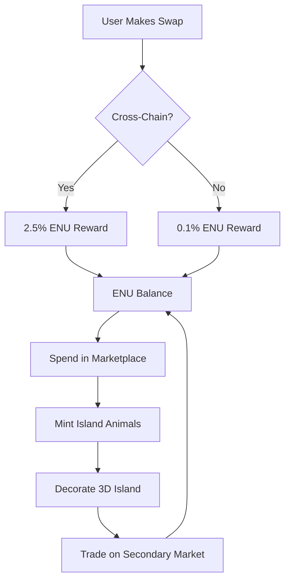

# 🏝️ Enju Platform - Smart Contracts

The **Enju Platform Smart Contracts** power the tokenized ecosystem for our 3D Dynamic Island DeFi platform. Users earn **ENU tokens** through platform activities and can mint/trade unique **Island Animals NFTs** to enhance their virtual islands.

## 🚀 Quick Start

### Prerequisites
- [Foundry](https://book.getfoundry.sh/) installed
- Node.js & npm/pnpm for frontend integration

### Installation
```bash
# Install dependencies
forge install

# Build contracts
forge build

# Clean cache
forge clean

# Format code
forge fmt

# Install new dependency
forge install openzeppelin/openzeppelin-contracts

# Gas snapshot
forge snapshot

# Deploy specific script
forge script script/DeployEnuEcosystem.s.sol --rpc-url $RPC_URL

# Verify contract
forge verify-contract $CONTRACT_ADDRESS src/EnuToken.sol:EnuToken --chain-id 1

# Create contract interface
forge inspect EnuToken abi > EnuToken.json
```

### Cast Commands
```bash
# Check token balance
cast call $ENU_TOKEN "balanceOf(address)" $USER_ADDRESS

# Mint animals via marketplace
cast send $MARKETPLACE "mintWithETH(uint256,address)" 1 $REFERRER 
  --value 0.001ether --private-key $PRIVATE_KEY

# Get NFT metadata
cast call $ISLAND_ANIMALS "tokenURI(uint256)" $TOKEN_ID

# Check marketplace listings
cast call $MARKETPLACE "listings(uint256)" $TOKEN_ID
```

## 🔐 Security Features

### Access Control
- **EnuToken:** Only CrossChainResolver can mint, only Marketplace can burn
- **IslandAnimals:** Only Marketplace can mint NFTs
- **Marketplace:** Owner can pause/unpause, set special events

### Economic Protection
- **Rate Limiting:** Controlled token inflation through fixed reward rates
- **Fee Structure:** 2.5% marketplace fees prevent spam trading
- **Rarity Enforcement:** On-chain trait generation ensures fair distribution

### Emergency Functions
- **Pause System:** All critical functions can be emergency paused
- **Upgrade Path:** Marketplace fees and rates can be adjusted by owner
- **Recovery:** Owner can withdraw stuck ETH/tokens

## 🌟 Advanced Features

### Referral System
```solidity
// 5% bonus for successful referrals
function mintWithENU(MintTier tier, address referrer) external {
    if (referrer != address(0) && referrer != msg.sender) {
        uint256 bonus = (mintPrices[tier] * 5) / 100;
        enuToken.transfer(referrer, bonus);
    }
}
```

### Dynamic Trait Generation
```solidity
// Pseudo-random traits based on blockhash + tokenId
function _generateTraits(uint256 tokenId) private view returns (AnimalTraits memory) {
    uint256 seed = uint256(keccak256(abi.encodePacked(blockhash(block.number - 1), tokenId)));
    // Complex trait generation algorithm...
}
```

### Special Events System
```solidity
// Temporary discount events
struct SpecialEvent {
    bool active;
    uint256 discountPercent; // 0-50% discount
    uint256 endTime;
}
```

## 📊 Gas Optimization

The contracts are optimized for minimal gas usage:

- **Batch Operations:** Multiple NFT mints in single transaction
- **Packed Structs:** Animal traits stored efficiently
- **Minimal Storage:** On-chain metadata generation reduces storage costs
- **OpenZeppelin:** Battle-tested implementations for security + efficiency

### Estimated Gas Costs
- ENU Token Transfer: ~21,000 gas
- Mint Basic Animal: ~150,000 gas  
- List Animal for Sale: ~80,000 gas
- Buy Animal: ~120,000 gas

## 🤝 Contributing

### Development Workflow
1. Fork repository and create feature branch
2. Write comprehensive tests for new functionality
3. Run full test suite: `forge test -vvv`
4. Check gas usage: `forge test --gas-report`
5. Format code: `forge fmt`
6. Submit pull request with detailed description

### Code Standards
- Follow [Solidity Style Guide](https://docs.soliditylang.org/en/latest/style-guide.html)
- Comprehensive NatSpec documentation
- 100% test coverage for new features
- Gas optimization without sacrificing readability

## 📄 License

This project is licensed under the MIT License - see the [LICENSE](../LICENSE) file for details.

---

## 🎯 **Next Steps**

Ready to enhance your 3D Dynamic Island platform:

1. **Deploy Ecosystem:** Run the deployment script on your preferred network
2. **Frontend Integration:** Use the generated ABIs to connect your React frontend  
3. **Testing:** Execute comprehensive test suite to validate functionality
4. **Customization:** Modify animal types, rarities, and marketplace tiers as needed

Your **tokenized 3D island ecosystem** is ready to launch! 🚀


# Deploy to local fork
forge script script/DeployEnuEcosystem.s.sol --fork-url http://localhost:8545 --broadcast
```

## 📋 Contract Architecture

### 🪙 **ENU Token (ERC20)**
**File:** `src/EnuToken.sol`

The platform's utility token with controlled minting and burning mechanics.

**Key Features:**
- ✅ Only mintable by authorized CrossChainResolver
- ✅ Swap rewards: 0.1% for regular, 2.5% for cross-chain bridges  
- ✅ Burnable for island upgrades via marketplace
- ✅ 18 decimal precision with comprehensive access control

**Usage:**
```solidity
// CrossChainResolver mints rewards
enuToken.mintSwapReward(user, amount, isCrossChain);

// Users burn tokens for upgrades
enuToken.burnForUpgrade(user, upgradeCost);
```

### 🐾 **Island Animals NFT (ERC721)**
**File:** `src/IslandAnimals.sol`

Collectible animals with unique traits for 3D island decoration.

**Animal Types & Rarities:**
- 🏔️ **Land:** Lions, Bears, Deer (Common-Rare)
- 🌊 **Sea:** Dolphins, Sharks, Whales (Common-Epic) 
- 🦅 **Sky:** Eagles, Dragons, Phoenix (Rare-Legendary)
- ✨ **Mythical:** Unicorns, Griffins, Krakens (Epic-Legendary)

**Trait System:**
- **Stats:** Strength, Agility, Magic (1-100 based on rarity)
- **Colors:** 12 base colors + 5% shiny variant chance
- **Rarity Distribution:** Common 50%, Uncommon 25%, Rare 15%, Epic 7%, Legendary 3%

**Usage:**
```solidity
// Marketplace mints random animals
uint256 tokenId = islandAnimals.mintAnimal(to, animalType, rarity);

// Get animal details
IslandAnimals.Animal memory animal = islandAnimals.getAnimal(tokenId);
```

### 🏪 **Animal Marketplace**
**File:** `src/AnimalMarketplace.sol`

Complete marketplace for minting and trading Island Animals.

**Minting Tiers:**
- 🥉 **Basic Pack:** 10 ENU / 0.001 ETH → Common-Uncommon animals
- 🥈 **Premium Pack:** 25 ENU / 0.0025 ETH → Common-Rare animals  
- 🥇 **Legendary Pack:** 50 ENU / 0.005 ETH → Rare-Legendary animals

**Features:**
- ✅ Dual payment system (ENU tokens or ETH)
- ✅ Secondary marketplace with 2.5% platform fees
- ✅ Referral system (5% bonus for referrer)
- ✅ Special events with discount pricing
- ✅ Emergency pause functionality

**Usage:**
```solidity
// Mint with ENU tokens
marketplace.mintWithENU(MintTier.PREMIUM, referrer);

// List animal for sale
marketplace.listAnimal(tokenId, priceInWei);

// Buy from secondary market
marketplace.buyAnimal{value: price}(tokenId);
```

### 🌉 **Cross-Chain Integration**
**File:** `src/CrossChainResolver.sol` (Enhanced)

Integrated with ENU token minting for cross-chain bridge rewards.

**New Features:**
- ✅ Automatic ENU token minting on successful swaps
- ✅ Enhanced reward rates for cross-chain bridges
- ✅ Integration with 1inch Fusion resolver

## 🧪 Testing

### Test Coverage
**File:** `test/EnuEcosystemTest.t.sol`

Comprehensive test suite covering:
- ✅ Token minting mechanics and access control
- ✅ NFT generation with proper trait distribution
- ✅ Marketplace functionality (minting, trading, fees)
- ✅ Cross-chain integration workflows
- ✅ Edge cases and security scenarios

### Run Tests
```bash
# Run all tests with verbose output
forge test -vvv

# Run specific test contract
forge test --match-contract EnuEcosystemTest -vvv

# Check gas usage
forge test --gas-report

# Coverage analysis
forge coverage
```

## 🚀 Deployment

### Local Development
```bash
# Start local node
anvil

# Deploy ecosystem (new terminal)
forge script script/DeployEnuEcosystem.s.sol \
  --fork-url http://localhost:8545 \
  --broadcast \
  --private-key 0xac0974bec39a17e36ba4a6b4d238ff944bacb478cbed5efcae784d7bf4f2ff80
```

### Mainnet Deployment
```bash
# Deploy to mainnet (requires proper private key)
forge script script/DeployEnuEcosystem.s.sol \
  --rpc-url $MAINNET_RPC_URL \
  --private-key $PRIVATE_KEY \
  --broadcast \
  --verify
```

## 🎮 Token Economy Flow



## 📖 API Reference

### EnuToken Functions
```solidity
function mintSwapReward(address to, uint256 amount, bool isCrossChain) external
function burnForUpgrade(address from, uint256 amount) external  
function transfer(address to, uint256 amount) external returns (bool)
```

### IslandAnimals Functions  
```solidity
function mintAnimal(address to, AnimalType animalType, Rarity rarity) external returns (uint256)
function getAnimal(uint256 tokenId) external view returns (Animal memory)
function tokenURI(uint256 tokenId) external view returns (string memory)
```

### AnimalMarketplace Functions
```solidity
function mintWithENU(MintTier tier, address referrer) external
function mintWithETH(MintTier tier, address referrer) external payable
function listAnimal(uint256 tokenId, uint256 price) external
function buyAnimal(uint256 tokenId) external payable
```

## 🔧 Development Tools

### Foundry Commands
```bash
$ forge build
```

### Test

```shell
$ forge test
```

### Format

```shell
$ forge fmt
```

### Gas Snapshots

```shell
$ forge snapshot
```

### Anvil

```shell
$ anvil
```

### Deploy

```shell
$ forge script script/Counter.s.sol:CounterScript --rpc-url <your_rpc_url> --private-key <your_private_key>
```

### Cast

```shell
$ cast <subcommand>
```

### Help

```shell
$ forge --help
$ anvil --help
$ cast --help
```
