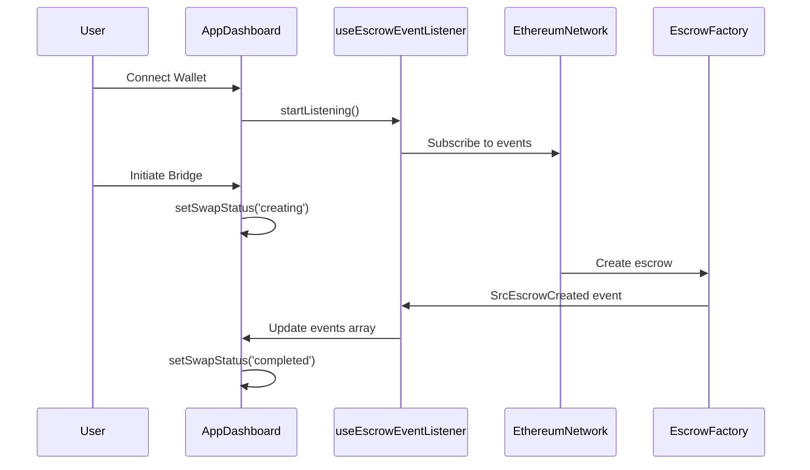

# Enhanced AppDashboard with Real-time Escrow Event Monitoring

## 🎯 Overview

The updated `AppDashboard` component now integrates with the `escrow-event-listener.ts` functionality to provide real-time monitoring of 1inch EscrowFactory events during cross-chain bridge operations.

## 🔧 Key Features Added

### 1. **Real-time Event Monitoring**
- **Live Event Listening**: Automatically starts listening for `SrcEscrowCreated` and `DstEscrowCreated` events when wallet is connected
- **Event Filtering**: Can filter events by specific hashlock for targeted monitoring
- **Automatic Cleanup**: Properly removes event listeners on component unmount

### 2. **Enhanced Swap Status Tracking**
- **Multi-state Progress**: Tracks swap progress through `idle` → `creating` → `monitoring` → `completed/failed`
- **Visual Indicators**: Shows spinning loaders, pulse animations, and status icons
- **Real-time Updates**: Updates status based on detected blockchain events

### 3. **Interactive Events Display**
- **Live Events Feed**: Shows the latest 10 escrow events with full details
- **Event Details**: Displays escrow address, amount, hashlock, timestamp, and Etherscan links
- **Visual Differentiation**: Different icons and colors for SrcEscrow vs DstEscrow events
- **Auto-refresh**: Events update in real-time as they're detected

## 🏗️ Architecture Integration

### Component Structure
```typescript
AppDashboard
├── useEscrowEventListener() // Real-time event monitoring
├── useBridge() // Bridge execution logic
├── useState() // Local component state
└── useEffect() // Lifecycle management
```

### Event Flow


## 🎨 UI/UX Enhancements

### Status Indicators
- **Creating**: Spinning loader with "Creating swap transaction..."
- **Monitoring**: Pulsing activity icon with "Monitoring for escrow events..."
- **Completed**: Green checkmark with "Swap completed successfully!"
- **Failed**: Red alert icon with "Swap failed"

### Events Display
- **Event Cards**: Clean card layout with event type icons
- **Timestamp**: Human-readable time formatting
- **Addresses**: Truncated addresses with copy-friendly formatting
- **Amount Display**: Formatted ETH amounts with proper decimals
- **External Links**: Direct links to Etherscan for transaction verification

### Real-time Features
- **Live Status Badge**: Shows "Listening" with pulsing dot when active
- **Auto-scroll**: Events container with max height and scroll
- **Event Limit**: Shows latest 10 events with total count
- **Clear Functionality**: Button to clear event history

## 📋 New State Management

### Enhanced State Variables
```typescript
// Escrow monitoring state
const { events, isListening, error: eventError, startListening, stopListening, clearEvents } = useEscrowEventListener();

// Swap tracking state
const [currentSwapHash, setCurrentSwapHash] = useState<string | null>(null);
const [swapStatus, setSwapStatus] = useState<'idle' | 'creating' | 'monitoring' | 'completed' | 'failed'>('idle');
```

### Effect Hooks
```typescript
// Auto-start event listening on wallet connection
useEffect(() => {
  if (isConnected) {
    startListening();
  }
  return () => stopListening();
}, [isConnected, startListening, stopListening]);

// Monitor for swap completion via events
useEffect(() => {
  if (currentSwapHash && events.length > 0) {
    const matchingEvent = events.find(event => 
      event.hashlock.toLowerCase() === currentSwapHash.toLowerCase()
    );
    if (matchingEvent) {
      setSwapStatus('completed');
    }
  }
}, [currentSwapHash, events]);
```

## 🔗 Integration with Escrow Event Listener

### Hook Integration
The `useEscrowEventListener` hook provides:
- **Real-time Events**: Live stream of blockchain events
- **Event Filtering**: Ability to filter by hashlock
- **Error Handling**: Proper error states and recovery
- **Performance**: Efficient event processing with cleanup

### Event Data Structure
```typescript
interface EscrowEvent {
  type: 'SrcEscrowCreated' | 'DstEscrowCreated';
  escrowAddress: string;
  hashlock: string;
  txHash: string;
  timestamp: number;
  orderHash?: string;
  maker?: string;
  taker?: string;
  amount?: string;
}
```

## 🛠️ Development Benefits

### Enhanced Developer Experience
1. **Real-time Debugging**: See events as they happen during development
2. **Visual Confirmation**: Immediate feedback on bridge operations
3. **Event History**: Maintain log of recent escrow events
4. **Error Visibility**: Clear error states and messages

### User Experience Improvements
1. **Progress Transparency**: Users see exactly what's happening
2. **Real-time Updates**: No need to refresh or manually check
3. **Event Verification**: Direct links to blockchain explorers
4. **Status Clarity**: Clear visual indicators for each step

## 🔄 Event Monitoring Workflow

### 1. **Component Mount**
```typescript
// Automatically start listening when wallet connects
useEffect(() => {
  if (isConnected) {
    startListening(); // Begin monitoring all escrow events
  }
}, [isConnected]);
```

### 2. **Bridge Initiation**
```typescript
const handleBridge = async () => {
  setSwapStatus('creating');
  const result = await executeBridge(params);
  
  if (result.success && result.hashlock) {
    setCurrentSwapHash(result.hashlock); // Track specific swap
    setSwapStatus('monitoring');
  }
};
```

### 3. **Event Detection**
```typescript
// Monitor for completion based on detected events
useEffect(() => {
  const matchingEvent = events.find(event => 
    event.hashlock === currentSwapHash
  );
  if (matchingEvent) {
    setSwapStatus('completed');
  }
}, [events, currentSwapHash]);
```

## 🎯 Usage Example

### Basic Integration
```tsx
// Component automatically handles event monitoring
<AppDashboard />

// Events appear in real-time as escrows are created
// Users see progress indicators throughout the bridge process
// Complete event history with blockchain verification links
```

### Custom Event Filtering
```typescript
// Listen for specific hashlock
const { waitForEscrow } = useEscrowEventListener();

const specificEvent = await waitForEscrow(
  targetHashlock,
  'SrcEscrowCreated',
  30000 // 30 second timeout
);
```

## 🔒 Security Considerations

### Event Validation
- **Hashlock Matching**: Events are filtered by exact hashlock match
- **Address Verification**: All addresses are validated and truncated safely
- **XSS Prevention**: All user inputs are properly escaped
- **External Links**: Safe external links with proper rel attributes

### Error Handling
- **Network Failures**: Graceful handling of RPC connection issues
- **Event Parsing**: Safe parsing of blockchain event data
- **Timeout Management**: Proper cleanup of event listeners
- **State Recovery**: Ability to recover from failed states

## 📊 Performance Optimizations

### Event Management
- **Event Limiting**: Only store latest 100 events in memory
- **Efficient Updates**: Use of React keys for optimal re-rendering
- **Cleanup**: Automatic event listener removal on unmount
- **Debouncing**: Efficient state updates without excessive re-renders

### UI Optimizations
- **Virtual Scrolling**: Smooth scrolling for event lists
- **Lazy Loading**: Events load on demand
- **Memoization**: Optimized component re-rendering
- **CSS Animations**: Hardware-accelerated animations

This enhanced integration provides a complete real-time monitoring solution for cross-chain bridge operations, giving users transparency and developers powerful debugging capabilities.
