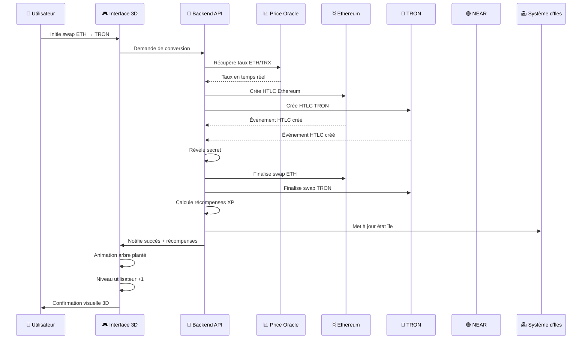
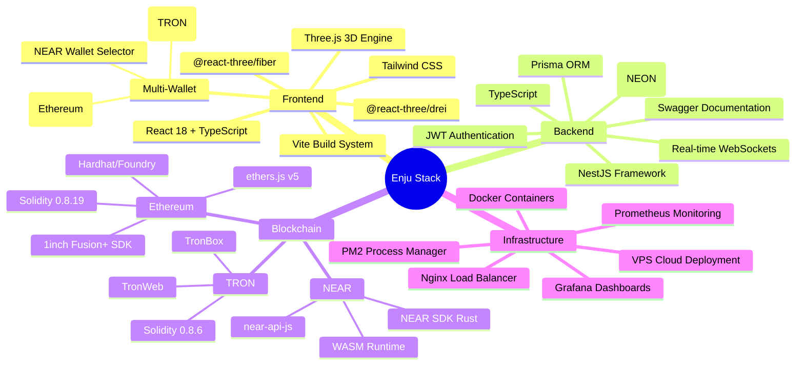

# 🌟 Enju - Gamified Cross-Chain Bridge Platform

## 🎯 Project Overview

**Enju** is a revolutionary cross-chain DeFi platform that transforms traditional bridging into an immersive gamified experience. Built as an extension to the 1inch Fusion+ protocol, it enables seamless **ETH ↔ NEAR ↔ TRON** atomic swaps while rewarding users with a unique 3D ecosystem that grows with their DeFi journey.

### 🏆 Current Implemented Features
- ✅ **Bidirectional Cross-Chain Bridge**: ETH ↔ TRON and ETH ↔ NEAR atomic swaps with HTLC security
- ✅ **1inch API Swap Integration**: ETH to multiple crypto swaps using 1inch API
- ✅ **Real-Time Price Oracle**: Automatic conversions using CoinGecko/Binance APIs
- ✅ **3D Immersive Interface**: Dynamic floating islands powered by Three.js
- ✅ **Transaction Visualization**: Every swap or bridge grows your island with trees and animations
- ✅ **Multi-Wallet Support**: MetaMask, TronLink, and NEAR Wallet integration
- ✅ **Level Progression System**: Gain XP and levels from swaps and bridges
- ✅ **Reward Token System**: Earn tokens for completing bridge operations
- ✅ **Interactive 3D Animals**: Chain-specific animated companions (Elephant for ETH, Tiger for TRON, Fox for NEAR)

### 🚀 Upcoming Features (Roadmap)
- 🏪 **NFT Marketplace**: Spend reward tokens on unique island decorations and upgrades
- 🎨 **Enhanced 3D Assets**: More detailed animal models and environmental elements
- 🏆 **Achievement System**: Unlock rare island items by hitting transaction milestones
- 🌐 **Extra Chain Support**: Extend bridges to other chains beyond ETH/NEAR/TRON

## 🏗️ Architecture Simple (look a the end)

```
┌─────────────────────────────────┐
│        ENJU FRONTEND            │
│  ┌─────────┐ ┌─────────────────┐│
│  │ Three.js│ │  React Components││
│  │ 3D World│ │  - Bridge UI    ││
│  │ Islands │ │  - Wallet Mgmt  ││
│  │ Animals │ │  - Level System ││
│  └─────────┘ └─────────────────┘│
└─────────────────┬───────────────┘
                  │
     ┌────────────┼────────────┐
     ▼            ▼            ▼
┌─────────┐  ┌─────────┐  ┌─────────┐
│ETHEREUM │  │  NEAR   │  │  TRON   │
│         │  │ (Coming)│  │         │
│CrossChain│  │htlc-near│  │TronFusion│
│Core     │  │.rs      │  │Bridge   │
│1inch    │  │Cross-   │  │HTLC +   │
│Fusion+  │  │chain    │  │Events   │
└─────────┘  └─────────┘  └─────────┘
     ▲            ▲            ▲
     │            │            │
     └────────────┼────────────┘
                  ▼
    ┌─────────────────────────────┐
    │     BRIDGE RESOLVER         │
    │  ┌─────────┐ ┌─────────────┐│
    │  │Price    │ │Event        ││
    │  │Oracle   │ │Listener     ││
    │  │CoinGecko│ │Multi-Chain  ││
    │  │Binance  │ │Monitoring   ││
    │  └─────────┘ └─────────────┘│
    └─────────────────────────────┘
```


## 💱 Supported Swaps

| From | To | Conversion | Example | Status |
|------|----|-----------| --------|--------|
| ETH | TRX | Auto price | 0.1 ETH → ~1120 TRX | ✅ Live |
| TRX | ETH | Auto price | 1000 TRX → ~0.089 ETH | ✅ Live |
| ETH | NEAR | Auto price | 0.1 ETH → ~140 NEAR | ✅ Live |
| NEAR | ETH | Auto price | 100 NEAR → ~0.071 ETH |✅ Live |

**Fees**: 0.3% bridge fee + gas costs

## 🔧 Technical Components


### Backend Services
- **Price Oracle** - Real-time ETH/NEAR/TRX rates with CoinGecko/Binance APIs
- **Bridge API** - REST endpoints for swap management
- **Event Monitor** - Cross-chain event listening and coordination
- **Resolver Service** - Atomic swap execution with price conversions

### Enju - 3D Gamified Frontend
- **React + Three.js** - Immersive 3D environment powered by `@react-three/fiber`
- **Dynamic Island Ecosystem** - Personal floating islands that evolve with transactions
- **3D Chain Animals** - Interactive companions: Elephant (ETH), Tiger (TRON), Fox (NEAR)
- **Transaction Visualization** - Bridge swaps generate trees, chests, and expand your world
- **Level Progression** - User levels increase with bridge activity and transaction volume
- **Multi-Wallet Support** - MetaMask, NEAR Wallet, TronLink integration
- **Interactive Elements** - Animated decorations, environmental growth, clickable objects
- **Persistent World** - Island state saves and loads with your transaction history
- **Procedural Generation** - Islands created from transaction seeds using noise algorithms
- **Reward System** - Earn tokens for completing bridges (upcoming feature)

## 🔒 Security Features

### 1inch Battle-Tested Infrastructure
- **EscrowFactory**: Uses official 1inch deployed contracts
- **Immutables Verification**: Ensures swap integrity
- **Timelock Protection**: 24-hour default expiration

### Atomic Guarantees
- **Same Hashlock**: Both chains use identical SHA256 hash
- **Coordinated Timelock**: Prevents partial completion
- **Emergency Recovery**: Owner can rescue stuck funds after 7 days

### Authorization System
- **Resolver Authorization**: Only authorized resolvers can execute
- **Owner Controls**: Emergency functions protected
- **Event Logging**: Full audit trail

## 📊 Testing Links: 


---

## 🏅 ETHGlobal Submission Highlights

### ✅ Fully Functional Demo Ready
- Live **ETH ↔ TRON** and **ETH ↔ NEAR** bridge with real transactions
- Complete **3D gamified interface** with chain-specific animated companions
- Multi-wallet integration (MetaMask + TronLink + NEAR Wallet)
- Real-time price oracle with automatic conversions
- Level progression + island growth tied to swap/bridge activity
- Token rewards system activated after bridge operations

### 🥇 Submission Tracks Targeted

#### 🌐 Extend Fusion+ to NEAR — **$32,000 Prize Pool**
- 🔁 Fully bidirectional ETH ↔ NEAR swaps with HTLC and coordinated timelocks
- 🛡️ SHA256 hashlock preserved across EVM ↔ non-EVM architecture
- 📡 Onchain execution demonstrated during live demo
- 🎮 Stretch goals met:
  - Immersive 3D UI integrated with actual bridge flow
  - Dynamic user feedback after bridge actions (tree planting, animal animations)

---

#### 🌐 Extend Fusion+ to TRON — **$32,000 Prize Pool**
- 🔁 Bidirectional ETH ↔ TRON swaps using HTLC-compatible contracts
- 🛡️ Full support for hashlock/timelock logic across Ethereum and TRON
- 🚀 TronLink wallet integration, live swaps shown on Shasta testnet
- 🎮 Stretch goals met:
  - Interactive island growth and level up after each swap
  - Real-time transaction visualization with 3D elements

---

#### 🧰 Build a Full Application using 1inch APIs — **$30,000 Prize Pool**
- 🔄 Full swap functionality using **1inch Swap API** for ETH → any token
- 📊 Real-time rates via **Price Feed API**
- 🧠 Integrated wallet detection & balance display using 1inch Wallet APIs
- 🎨 Frontend built with React + Three.js using 1inch APIs for all swaps

---

### 🎯 What Makes Enju Unique
- **First gamified DeFi bridge** with real-time, cross-chain execution
- **EVM ↔ non-EVM HTLC architecture** implemented for NEAR and TRON
- **Real user actions = in-game growth**, making DeFi visual and intuitive
- **Rewarded bridging**: token incentives, leveling system, and future NFTs

---

# Enju - Architecture Complète et Analyse du Projet

## 🏗️ Architecture Complète - Schéma Mermaid

```mermaid
graph TB
    subgraph "🎮 Frontend Layer - Enju 3D World"
        UI[React + Vite Frontend]
        THREE[Three.js 3D Engine]
        ISLANDS[Dynamic Islands System]
        ANIMALS[Chain Animals<br/>🐘 ETH, 🐅 TRON, 🦊 NEAR]
        WALLET[Multi-Wallet Integration<br/>MetaMask, TronLink, NEAR]
        GAMIFICATION[Gamification System<br/>Levels, XP, Rewards]
    end

    subgraph "🔗 Multi-Chain Integration"
        ETH_CHAIN[Ethereum Network]
        TRON_CHAIN[TRON Network]
        NEAR_CHAIN[NEAR Network]
        INCH_API[1inch Swap API]
    end

    subgraph "🏢 Backend Services - NestJS"
        API_SERVER[NestJS API Server]
        AUTH_SERVICE[Authentication Service]
        BRIDGE_SERVICE[Bridge Service]
        ISLANDS_SERVICE[Islands Service]
        REWARDS_SERVICE[Rewards Service]
        ONEINCH_SERVICE[1inch Integration Service]
        TRANSACTIONS_SERVICE[Transactions Service]
        USERS_SERVICE[Users Service]
        RPC_SERVICE[RPC Management Service]
    end

    subgraph "🌉 Cross-Chain Bridge System"
        BRIDGE_LISTENER[Bridge Event Listener]
        PRICE_ORACLE[Real-Time Price Oracle<br/>CoinGecko + Binance APIs]
        BRIDGE_RESOLVER[Cross-Chain Resolver]
        ETH_LISTENER[Ethereum Event Listener]
        TRON_LISTENER[TRON Event Listener]
        NEAR_LISTENER[NEAR Event Listener]
    end

    subgraph "📊 Smart Contracts"
        ETH_ESCROW[1inch EscrowFactory<br/>Battle-tested Security]
        ETH_BRIDGE[CrossChainCore.sol]
        ETH_INCH_BRIDGE[InchDirectBridge.sol]
        TRON_BRIDGE[TronFusionBridge.sol<br/>HTLC + Fund Transfers]
        NEAR_HTLC[HTLC Contract<br/>htlc-near.rs]
        REWARD_TOKEN[RewardToken.sol]
        ANIMAL_NFT[AnimalNFT.sol]
        MARKETPLACE[AnimalMarketplace.sol]
    end

    subgraph "💾 Database & Storage"
        POSTGRES[(PostgreSQL Database<br/>NEON Cloud)]
        PRISMA[Prisma ORM]
        USER_DATA[(User Profiles & Progress)]
        ISLAND_DATA[(Island States & Assets)]
        TRANSACTION_DATA[(Transaction History)]
        REWARD_DATA[(Rewards & Achievements)]
    end

    subgraph "🔐 Security & Infrastructure"
        JWT_AUTH[JWT Authentication]
        RATE_LIMIT[Rate Limiting]
        INPUT_VALIDATION[Input Validation]
        EMERGENCY_STOP[Emergency Stop Mechanisms]
        AUDIT_LOGS[Audit Trail System]
    end

    subgraph "☁️ Cloud Infrastructure"
        VPS[VPS Server Deployment]
        NGINX[Nginx Load Balancer]
        PM2[PM2 Process Manager]
        DOCKER[Docker Containers]
        MONITORING[Prometheus + Grafana]
    end

    %% Frontend Connections
    UI --> THREE
    UI --> ISLANDS
    UI --> ANIMALS
    UI --> WALLET
    UI --> GAMIFICATION
    UI --> API_SERVER

    %% Backend Service Connections
    API_SERVER --> AUTH_SERVICE
    API_SERVER --> BRIDGE_SERVICE
    API_SERVER --> ISLANDS_SERVICE
    API_SERVER --> REWARDS_SERVICE
    API_SERVER --> ONEINCH_SERVICE
    API_SERVER --> TRANSACTIONS_SERVICE
    API_SERVER --> USERS_SERVICE
    API_SERVER --> RPC_SERVICE

    %% Bridge System Connections
    BRIDGE_SERVICE --> BRIDGE_LISTENER
    BRIDGE_SERVICE --> PRICE_ORACLE
    BRIDGE_SERVICE --> BRIDGE_RESOLVER
    BRIDGE_LISTENER --> ETH_LISTENER
    BRIDGE_LISTENER --> TRON_LISTENER
    BRIDGE_LISTENER --> NEAR_LISTENER

    %% Blockchain Connections
    ETH_LISTENER --> ETH_CHAIN
    TRON_LISTENER --> TRON_CHAIN
    NEAR_LISTENER --> NEAR_CHAIN
    ONEINCH_SERVICE --> INCH_API

    %% Smart Contract Connections
    ETH_CHAIN --> ETH_ESCROW
    ETH_CHAIN --> ETH_BRIDGE
    ETH_CHAIN --> ETH_INCH_BRIDGE
    ETH_CHAIN --> REWARD_TOKEN
    ETH_CHAIN --> ANIMAL_NFT
    ETH_CHAIN --> MARKETPLACE
    TRON_CHAIN --> TRON_BRIDGE
    NEAR_CHAIN --> NEAR_HTLC

    %% Database Connections
    API_SERVER --> PRISMA
    PRISMA --> POSTGRES
    POSTGRES --> USER_DATA
    POSTGRES --> ISLAND_DATA
    POSTGRES --> TRANSACTION_DATA
    POSTGRES --> REWARD_DATA

    %% Security Layer
    API_SERVER --> JWT_AUTH
    API_SERVER --> RATE_LIMIT
    API_SERVER --> INPUT_VALIDATION
    BRIDGE_SERVICE --> EMERGENCY_STOP
    API_SERVER --> AUDIT_LOGS

    %% Infrastructure
    VPS --> NGINX
    VPS --> PM2
    VPS --> DOCKER
    VPS --> MONITORING

    %% Styling
    classDef frontend fill:#61DAFB,stroke:#000,color:#000
    classDef backend fill:#E0234E,stroke:#fff,color:#fff
    classDef blockchain fill:#627EEA,stroke:#fff,color:#fff
    classDef bridge fill:#FF6B6B,stroke:#fff,color:#fff
    classDef contracts fill:#9B59B6,stroke:#fff,color:#fff
    classDef database fill:#336791,stroke:#fff,color:#fff
    classDef security fill:#E74C3C,stroke:#fff,color:#fff
    classDef infrastructure fill:#2ECC71,stroke:#fff,color:#fff

    class UI,THREE,ISLANDS,ANIMALS,WALLET,GAMIFICATION frontend
    class API_SERVER,AUTH_SERVICE,BRIDGE_SERVICE,ISLANDS_SERVICE,REWARDS_SERVICE,ONEINCH_SERVICE,TRANSACTIONS_SERVICE,USERS_SERVICE,RPC_SERVICE backend
    class ETH_CHAIN,TRON_CHAIN,NEAR_CHAIN,INCH_API blockchain
    class BRIDGE_LISTENER,PRICE_ORACLE,BRIDGE_RESOLVER,ETH_LISTENER,TRON_LISTENER,NEAR_LISTENER bridge
    class ETH_ESCROW,ETH_BRIDGE,ETH_INCH_BRIDGE,TRON_BRIDGE,NEAR_HTLC,REWARD_TOKEN,ANIMAL_NFT,MARKETPLACE contracts
    class POSTGRES,PRISMA,USER_DATA,ISLAND_DATA,TRANSACTION_DATA,REWARD_DATA database
    class JWT_AUTH,RATE_LIMIT,INPUT_VALIDATION,EMERGENCY_STOP,AUDIT_LOGS security
    class VPS,NGINX,PM2,DOCKER,MONITORING infrastructure
```



## 🔄 Flux de Données Cross-Chain



## 🏗️ Stack Technique Détaillé



**🌟 Enju: Transforming DeFi accessibility through immersive gamification. Where every cross-chain swap grows your personal 3D world, making blockchain complexity beautiful and intuitive.**
