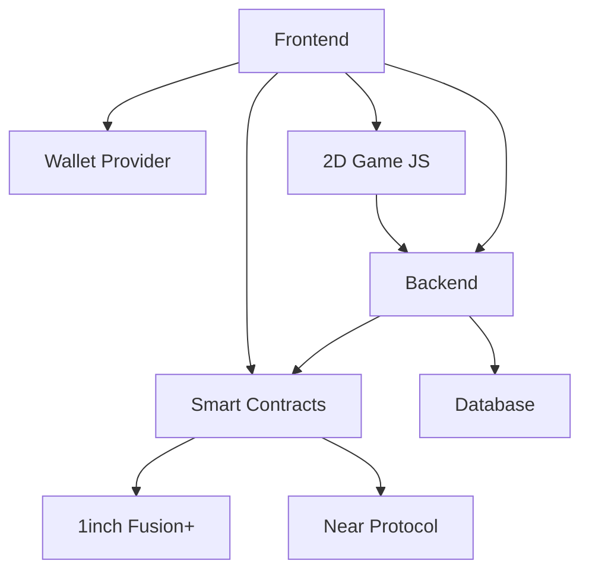

# 🌐 Mokuen SwapForest — ETHGlobal 1inch Hackathon Project

---

## 🔧 Main Features

### 1. Multichain Swap & Bridge
- Integration with 1inch Fusion+ for optimal swaps.
- Support for Near blockchain and a third chain (e.g., Arbitrum, Polygon, etc.).
- Interchain bridge for seamless token transfers between supported blockchains.

### 2. Transactional Rewards
- Every swap or bridge transaction generates rewards in tokens specific to the blockchain used.
- Example: $LEAF (Near), $SPARK (1inch), $??? (other).
- Tokens are not just utilities: they are used in a game linked to the app.

---

## 🎮 Integrated 2D Game — Inspired by Stardew Valley

### 1. Universe & Gameplay
- Each user owns an evolving forest biome.
- By using the swap/bridge app, players level up and unlock new biome elements:
  - 🌿 Rare plants
  - 🐣 Animal eggs
  - 🌳 Special trees
- Time and levels influence animal birth/growth.

### 2. Symbolic Animals & NFTs
- Each blockchain is associated with a unique animal NFT:
  - 🦄 Unicorn for 1inch
  - 🦊 Magic Fox for Near
  - 🐉 (To be defined for the 3rd blockchain)
- Animal NFTs can evolve, breed, and interact.
- They provide passive bonuses in the game and potentially in the main app (fee reduction, reward boost, etc.).

---

## 🧩 Additional Features
- Community DAO to vote on new biomes, animals, or blockchains.
- Internal NFT marketplace to trade rare animals and plants.
- Web3 quests (e.g., perform X swaps on Near to unlock a mystical mini-tree).

---

## 🏗️ Project Architecture

**Key Points:**
- The 2D game runs fully in JavaScript within the frontend (no external game engine).
- The frontend manages UI, game logic, wallet connection, and NFT display.
- The backend orchestrates blockchain interactions, reward distribution, and off-chain data.
- Smart contracts handle swaps, bridges, rewards, and NFTs.
- Database stores profiles, inventory, and progression.
- DeFi protocols (1inch, Near) are integrated via smart contracts.
