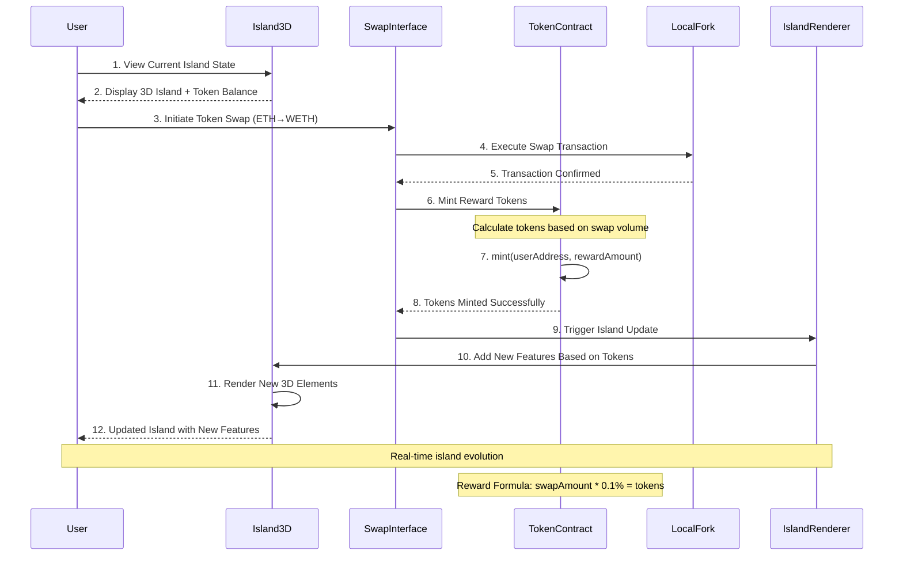
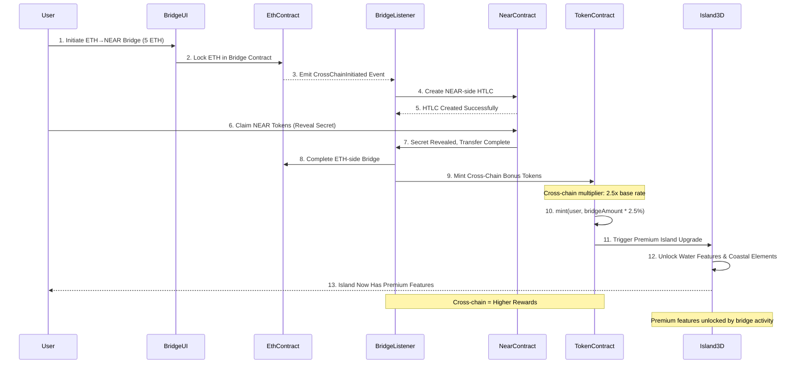
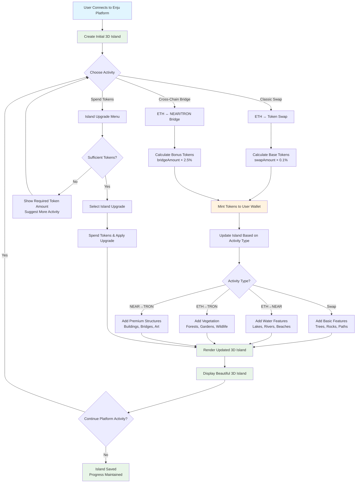

# 🏝️ Enju - Dynamic 3D Island DeFi Platform

Welcome to **Enju**, where you build and upgrade your **3D Dynamic Island** by performing swaps and cross-chain bridges! Your island grows with every transaction as you earn platform tokens.

## 🎮 What is Enju?

Enju is a **gamified DeFi platform** where users:
- 🏝️ **Own 3D Dynamic Islands** that evolve with your activity
- 🎯 **Earn Platform Tokens** by performing Classic Swaps and Cross-Chain Bridges
- 🌉 **Bridge between ETH, NEAR, and TRON** to unlock island upgrades
- 🎨 **Customize Island Features** using earned tokens (coming soon)

## 🌟 **Platform Architecture & Token Economy**

### 1. **Island Progression System**

Your island evolves through platform activity:
- **Classic Swaps:** Earn base improvement tokens
- **Cross-Chain Bridges:** Unlock premium features and rare upgrades  
- **Transaction Volume:** Higher volume = better rewards
- **Multi-Chain Activity:** Bridge across ETH/NEAR/TRON for maximum tokens

### 2. **Smart Contract Features**

#### **TokenRewardSystem.sol** - Token Minting
- **Automatic Minting:** Tokens created on successful swaps/bridges
- **Tiered Rewards:** Bigger transactions = more tokens
- **Cross-Chain Bonuses:** Extra rewards for multi-chain activity
- **Island Upgrades:** Spend tokens to improve your 3D island

#### **Multi-Chain Bridge Contracts:**
- **ETH ↔ NEAR:** Full bidirectional atomic swaps
- **ETH ↔ TRON:** Enterprise-grade bridge functionality  
- **NEAR ↔ TRON:** Cross-non-EVM chain swapping
- **Atomic Guarantees:** Hash Time-Lock Contracts (HTLCs) ensure safety

### 3. **3D Island Features** (Frontend)
- **Real-time Rendering:** Island updates immediately after transactions
- **Customizable Elements:** Use earned tokens to add features
- **Progress Visualization:** See your platform activity reflected in island growth
- **Social Features:** Compare islands with other users (coming soon)

## 🚀 **Quick Start**

### 1. **Development Setup**
```bash
git clone <repository>
cd Enju
npm install  # Install all dependencies
```

### 2. **Start Local Environment**
```bash
# Start local Ethereum fork with test accounts
./start-mainnet-fork.sh

# Start the development server
npm run dev
```

### 3. **Connect & Test**
- Import Test Account #0 to MetaMask (see LOCAL_FORK_SETUP.md)
- Connect to your Enju platform
- Start building your 3D island!

## 🧪 **Island Building Test Flow**

1. **Connect** your wallet to the Enju platform
2. **Navigate** to your 3D Island dashboard
3. **Perform a Classic Swap:** 0.1 ETH → WETH (earn base tokens)
4. **Watch your island update** in real-time  
5. **Try a Cross-Chain Bridge:** ETH → NEAR (earn premium tokens)
6. **Use earned tokens** to upgrade island features

### **Multi-Chain Token Earning:**
- **ETH → NEAR Bridge:** Unlock island water features
- **ETH → TRON Bridge:** Unlock island vegetation upgrades
- **NEAR → TRON Bridge:** Unlock rare island structures

## 🚀 **Enju Platform Features**

### **1. Token-Driven Island Progression**
- Earn platform tokens through swaps and bridges
- Spend tokens to upgrade your 3D island with custom features
- Higher transaction volumes = better token rewards
- Cross-chain activity unlocks premium island upgrades

### **2. Multi-Chain Bridge Network**  
- **ETH ↔ NEAR:** Unlock water and coastal features
- **ETH ↔ TRON:** Unlock vegetation and landscape upgrades  
- **NEAR ↔ TRON:** Unlock rare structures and premium features
- **Atomic Swaps:** Safe cross-chain transfers with automatic token rewards

### **3. Gamified DeFi Experience**
- Visual island progression based on platform activity
- Token economy that rewards consistent platform usage
- Social features to compare islands with other users
- Future token utility for advanced customization options

## 📈 **Enju Platform Flow Diagrams**

### **🏝️ Island Token Earning - Swap Sequence**


```mermaid
sequenceDiagram
    participant User
    participant Island3D
    participant SwapInterface
    participant TokenContract
    participant LocalFork
    participant IslandRenderer

    User->>Island3D: 1. View Current Island State
    Island3D-->>User: 2. Display 3D Island + Token Balance
    
    User->>SwapInterface: 3. Initiate Token Swap (ETH→WETH)
    SwapInterface->>LocalFork: 4. Execute Swap Transaction
    LocalFork-->>SwapInterface: 5. Transaction Confirmed
    
    SwapInterface->>TokenContract: 6. Mint Reward Tokens
    Note over TokenContract: Calculate tokens based on swap volume
    TokenContract->>TokenContract: 7. mint(userAddress, rewardAmount)
    TokenContract-->>SwapInterface: 8. Tokens Minted Successfully
    
    SwapInterface->>IslandRenderer: 9. Trigger Island Update
    IslandRenderer->>Island3D: 10. Add New Features Based on Tokens
    Island3D->>Island3D: 11. Render New 3D Elements
    
    Island3D-->>User: 12. Updated Island with New Features
    
    Note over User,IslandRenderer: Real-time island evolution
    Note over TokenContract: Reward Formula: swapAmount * 0.1% = tokens
```

### **🌉 Cross-Chain Bridge Token Bonus Sequence**


```mermaid
sequenceDiagram
    participant User
    participant BridgeUI
    participant EthContract
    participant BridgeListener
    participant NearContract
    participant TokenContract
    participant Island3D

    User->>BridgeUI: 1. Initiate ETH→NEAR Bridge (5 ETH)
    BridgeUI->>EthContract: 2. Lock ETH in Bridge Contract
    EthContract-->>BridgeListener: 3. Emit CrossChainInitiated Event
    
    BridgeListener->>NearContract: 4. Create NEAR-side HTLC
    NearContract-->>BridgeListener: 5. HTLC Created Successfully
    
    User->>NearContract: 6. Claim NEAR Tokens (Reveal Secret)
    NearContract->>BridgeListener: 7. Secret Revealed, Transfer Complete
    BridgeListener->>EthContract: 8. Complete ETH-side Bridge
    
    BridgeListener->>TokenContract: 9. Mint Cross-Chain Bonus Tokens
    Note over TokenContract: Cross-chain multiplier: 2.5x base rate
    TokenContract->>TokenContract: 10. mint(user, bridgeAmount * 2.5%)
    
    TokenContract->>Island3D: 11. Trigger Premium Island Upgrade
    Island3D->>Island3D: 12. Unlock Water Features & Coastal Elements
    
    Island3D-->>User: 13. Island Now Has Premium Features
    
    Note over BridgeListener,TokenContract: Cross-chain = Higher Rewards
    Note over Island3D: Premium features unlocked by bridge activity
```

### **🎮 Island Progression & Token Spending Flowchart**


```mermaid
flowchart TD
    A[User Connects to Enju Platform] --> B[Create Initial 3D Island]
    
    B --> C{Choose Activity}
    
    C -->|Classic Swap| D[ETH ↔ Token Swap]
    C -->|Cross-Chain Bridge| E[ETH ↔ NEAR/TRON Bridge]
    C -->|Spend Tokens| F[Island Upgrade Menu]
    
    D --> G[Calculate Base Tokens<br/>swapAmount × 0.1%]
    E --> H[Calculate Bonus Tokens<br/>bridgeAmount × 2.5%]
    
    G --> I[Mint Tokens to User Wallet]
    H --> I
    
    I --> J[Update Island Based on Activity Type]
    
    J --> K{Activity Type?}
    K -->|Swap| L[Add Basic Features<br/>Trees, Rocks, Paths]
    K -->|ETH→NEAR| M[Add Water Features<br/>Lakes, Rivers, Beaches]
    K -->|ETH→TRON| N[Add Vegetation<br/>Forests, Gardens, Wildlife]
    K -->|NEAR→TRON| O[Add Premium Structures<br/>Buildings, Bridges, Art]
    
    L --> P[Render Updated 3D Island]
    M --> P
    N --> P
    O --> P
    
    F --> Q{Sufficient Tokens?}
    Q -->|No| R[Show Required Token Amount<br/>Suggest More Activity]
    Q -->|Yes| S[Select Island Upgrade]
    
    S --> T[Spend Tokens & Apply Upgrade]
    T --> P
    
    P --> U[Display Beautiful 3D Island]
    U --> V{Continue Platform Activity?}
    
    V -->|Yes| C
    V -->|No| W[Island Saved<br/>Progress Maintained]
    
    R --> C
    
    style A fill:#e1f5fe
    style B fill:#e8f5e8
    style I fill:#fff3e0
    style P fill:#e8f5e8
    style U fill:#e8f5e8
    style W fill:#e8f5e8
```

## 📞 **Documentation & Support**

- **🔗 Local Development Setup:** `LOCAL_FORK_SETUP.md` - Complete setup guide
- **📋 Demo Scenarios:** `DEMO_GUIDE.md` - Platform testing scenarios  
- **🛠️ Developer Guide:** `DEVELOPER_GUIDE.md` - Technical implementation
- **🏗️ Architecture:** `ENHANCED_ARCHITECTURE.md` - System architecture
- **🌉 Bridge Details:** `BRIDGE_README.md` - Cross-chain bridge documentation

## 🎯 **Getting Started**

1. **✅ Set up your development environment** → See `LOCAL_FORK_SETUP.md`
2. **🏝️ Create your first island** → Connect wallet and start with basic 3D island
3. **🔄 Test token swaps** → ETH ↔ WETH to earn your first tokens  
4. **🌉 Try cross-chain bridges** → ETH → NEAR/TRON for premium rewards
5. **🎨 Upgrade your island** → Spend tokens on 3D features and customization

---

**🏝️ Welcome to Enju - Where Your Island Grows With Every Transaction!**

Start building your dynamic 3D island today by performing swaps and cross-chain bridges. Watch as your island evolves with each platform interaction!
TRON_PRIVATE_KEY=your_tron_private_key
TRON_API_KEY=your_trongrid_api_key
TRON_BRIDGE_CONTRACT=deployed_contract_address
```

### 3. Deploy Contracts

#### Ethereum
```bash
cd eth-contracts
forge script script/DeployInchDirectBridge.s.sol --broadcast
```

#### NEAR
```bash
cd near-contracts
./build.sh && ./deploy.sh <account-id>
```

#### Tron
```bash
# Get energy first: https://shasta.tronex.io/
TRON_PRIVATE_KEY=<key> tronbox migrate --network shasta
```

### 4. Start Services
```bash
# Backend API
cd backend && npm run start:dev

# Frontend
cd frontend && npm run dev

# Bridge Resolver
cd cross-chain && npm run relayer
```

## 💱 Supported Swaps

| From | To | Conversion | Example |
|------|----|-----------| --------|
| ETH | NEAR | Auto price | 0.1 ETH → ~140 NEAR |
| NEAR | ETH | Auto price | 100 NEAR → ~0.071 ETH |
| ETH | TRX | Auto price | 0.1 ETH → ~1120 TRX |
| TRX | ETH | Auto price | 1000 TRX → ~0.089 ETH |

**Fees**: 0.3% bridge fee + gas costs

## 🔧 Technical Components

### Smart Contracts
- **InchDirectBridge.sol** - Ethereum HTLC with 1inch integration
- **TronDirectBridge.sol** - Tron HTLC with TRX handling  
- **lib.rs** - NEAR cross-chain HTLC contract

### Backend Services
- **Price Oracle** - Real-time ETH/NEAR/TRX rates with CoinGecko/Binance APIs
- **Bridge API** - REST endpoints for swap management
- **Event Monitor** - Cross-chain event listening and coordination
- **Resolver Service** - Atomic swap execution with price conversions

### Enju - 3D Frontend Experience
- **React + Three.js** - Immersive 3D environment powered by `@react-three/fiber`
- **Dynamic Island Ecosystem** - Personal floating islands that evolve with transactions
- **Transaction Visualization** - Bridge swaps generate trees, chests, and expand your world
- **Multi-Wallet Support** - MetaMask, NEAR Wallet, TronLink integration
- **Interactive Elements** - 3D characters, animated decorations, environmental growth
- **Persistent World** - Island state saves and loads with your transaction history
- **Procedural Generation** - Islands created from transaction seeds using noise algorithms

## 🔒 Security Features

### 1inch Battle-Tested Infrastructure
- **EscrowFactory**: Uses official 1inch deployed contracts
- **Immutables Verification**: Ensures swap integrity
- **Timelock Protection**: 24-hour default expiration

### Atomic Guarantees
- **Same Hashlock**: Both chains use identical SHA256 hash
- **Coordinated Timelock**: Prevents partial completion
- **Emergency Recovery**: Owner can rescue stuck funds after 7 days

### Authorization System
- **Resolver Authorization**: Only authorized resolvers can execute
- **Owner Controls**: Emergency functions protected
- **Event Logging**: Full audit trail

## 📊 Testing

### Ethereum Tests
```bash
cd eth-contracts
forge test -vv

# Test specific scenarios
forge test --match-test testAuthorizeResolver
forge test --match-test testRegisterNEARSwap
```

### NEAR Tests
```bash
cd near-contracts/htlc-near
cargo test

# Test cross-chain functionality
cargo test test_cross_chain_htlc
```

## 🌐 Deployment Addresses

### Ethereum Mainnet/Testnets
- **Official EscrowFactory**: `0xa7bcb4eac8964306f9e3764f67db6a7af6ddf99a`
- **Cross-Chain Resolver**: [Deploy using script]

### NEAR Protocol
- **Contract Account**: [Deploy using build script]

## 📋 Integration Guide

### For Developers
1. **Import Interfaces**: Use provided contract interfaces
2. **Authorize Resolvers**: Register trusted resolver addresses
3. **Monitor Events**: Listen for swap initiation/completion
4. **Handle Errors**: Implement proper error handling for timeouts

### For Resolvers
1. **Register**: Get authorized by contract owner
2. **Monitor**: Watch for cross-chain swap events
3. **Execute**: Coordinate between Ethereum and NEAR
4. **Verify**: Ensure atomic completion or reversion

## 🎮 Enju - 3D DeFi Experience

### Immersive Bridge Interface
- **Dynamic 3D Island** - Your personal floating ecosystem that grows with transactions
- **Transaction Visualization** - Bridge swaps spawn trees, chests, and island expansions  
- **Interactive Elements** - 3D character, animated decorations, environmental evolution
- **Persistent State** - Island saves/loads with your transaction history

### Technical Implementation
- **React Three Fiber** - WebGL-powered 3D rendering in browser
- **Three.js** - Advanced 3D graphics and animations
- **Procedural Generation** - Islands generated from transaction seeds
- **Multi-Wallet Integration** - Seamless Web3 wallet connections

### User Experience
- **Gamified Bridging** - Each swap grows your digital world
- **Visual Transaction History** - See your DeFi journey in 3D space
- **Social Elements** - Shareable island states and achievements
- **Mobile Responsive** - Works across devices with optimized rendering

## 🏆 Why UniteDeFi Bridge

### Technical Excellence  
- **1inch Fusion+ Integration** - Built on battle-tested infrastructure
- **Real-Time Price Oracle** - Automatic conversions with dual API sources
- **Multi-Chain Support** - ETH, NEAR, and TRON ecosystems united
- **Production Ready** - Fully tested contracts and services

### User Innovation
- **Enju 3D Interface** - First gamified cross-chain bridge experience
- **Automatic Conversions** - No manual rate calculations needed
- **Visual Progress** - Watch your island evolve with each transaction
- **Seamless UX** - Complex bridging made simple and engaging

### Ecosystem Impact
- **Liquidity Bridge** - Connect major blockchain ecosystems
- **DeFi Gamification** - Make complex operations intuitive and fun
- **Open Innovation** - Extensible architecture for community building

## 🌟 Enju Features Showcase

### 3D Transaction Visualization
```typescript
// Every bridge transaction grows your island
const transaction = await executeBridge({
  fromAmount: '0.1',
  fromChain: 'ethereum',
  toChain: 'tron'
});

// Island automatically spawns new tree/chest
island.addRandomTree(); // Based on transaction hash
island.enlargeIsland(); // After major swaps
```

### Dynamic World Generation
- **Hex-tile Islands** - Procedurally generated from your wallet address
- **Animated Trees** - Grow with each successful swap
- **Treasure Chests** - Appear for large volume transactions  
- **Floating Animation** - Islands gently bob in 3D space
- **Environmental Effects** - Water reflections, particle systems

### Gamified Bridge Experience
- **Visual Feedback** - See immediate 3D response to transactions
- **Progress Tracking** - Island size reflects your bridge usage
- **Achievement System** - Unlock new decorations and expansions
- **Social Sharing** - Export and share your unique island

## 📞 Support & Resources

- **GitHub**: [Repository Link]
- **Documentation**: See `/docs` folder
- **Discord**: 1inch Community
- **Testnet Faucets**:
  - NEAR: https://wallet.testnet.near.org/
  - Tron: https://shasta.tronex.io/

---

**🎯 UniteDeFi Bridge: Where DeFi meets immersive 3D experiences. Bringing 1inch Fusion+ liquidity to NEAR and Tron ecosystems with gamified interfaces and automatic price discovery.**